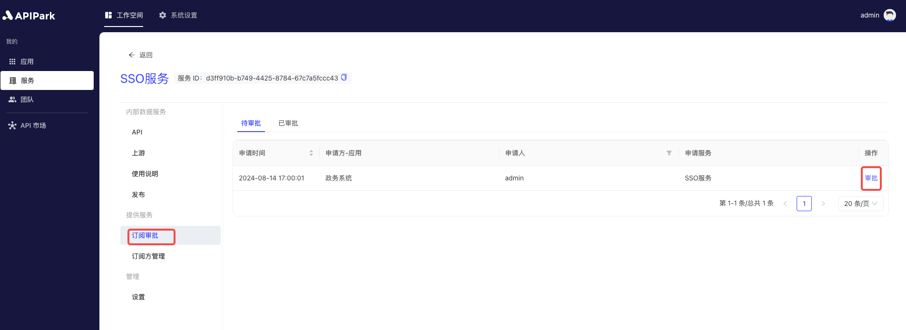
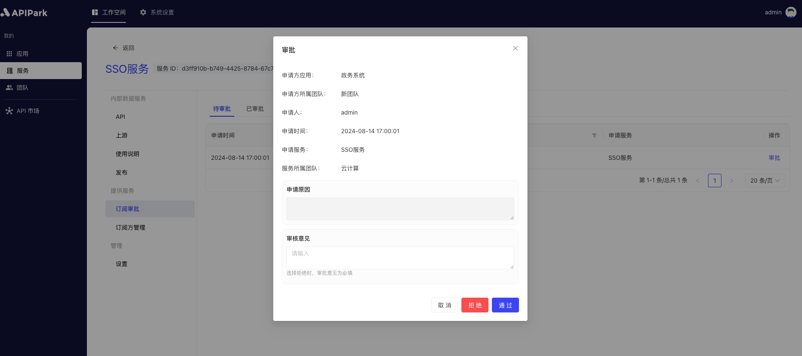

# Subscription Approval

Subscription approval involves the process where the service provider reviews and approves API service subscription requests from subscribers within `APIPark`. This process ensures that only authorized users have access to specific API services, safeguarding the system's security and service quality.

## Steps

1. Select the service that needs approval and enter the internal page of the service.

2. Click on `Subscription Approval` to enter the pending approval list, then click on the approval button at the end.

  

3. In the pop-up box, enter your approval comments and click `Approve` or `Reject`.

