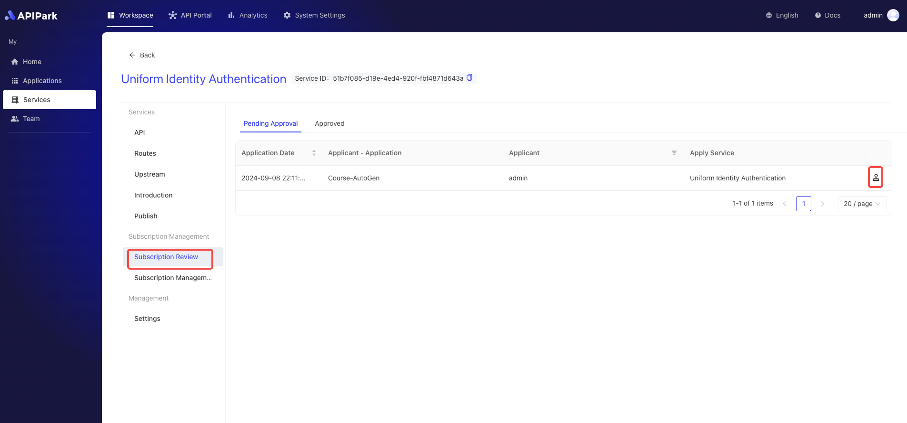

# Subscription Approval

Subscription approval in `APIPark` is the process by which service providers review and approve API service subscription requests submitted by subscribers. This process ensures that only authorized users can access specific API services, safeguarding system security and service quality.

## Operational Steps

1. Select the service that needs approval and enter the service details page.

2. Click on `Subscription Review`, enter the pending approval list, and click on the approval option at the end.

  

3. In the pop-up box, enter your approval comments and click `Approve` or `Reject`.

  
