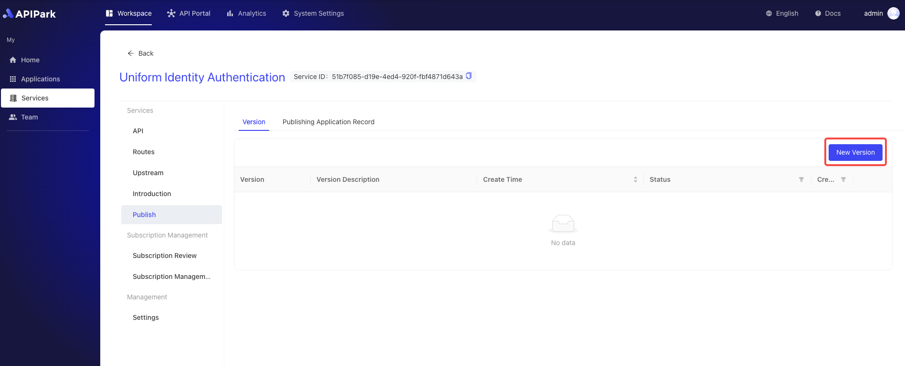

# Release Version

Releasing a service version is a critical step in deploying the latest configured services and APIs to the production environment, ensuring that subscribers can access the latest released version of the APIs when making calls. By releasing a service version, you can unify the management of the lifecycle of APIs and services, ensuring that the latest configurations of services and APIs take effect timely, thus ensuring the system's stability and reliability.

After performing the release operation, if the current service is an `external service`, it will be displayed in the service plaza.

## Operation Demonstration

:::tip

Before proceeding, the following conditions must be met:

1. APIPark has completed the gateway cluster configuration operations, and the gateway cluster is in good working condition. If not, please refer to the tutorial [Configure Gateway Cluster](../pre-work/cluster.md#operation-demonstration).
2. Upstream configuration is completed. If not, please refer to the tutorial [Configure Upstream](./upstream.md#operation-demonstration).
3. The API has been added. If not, please refer to the tutorial [Add API](./api.md#operation-demonstration).

:::

1. Select the service you want to configure and enter the internal page of the service.

2. Click `Publish` and then Click`New Version`.

  

3. Enter the version description information in the pop-up box, and after completing it, click `Confirm`.

   

After the release is complete, if the service is an external service, it will be displayed in the service plaza for subscribers to subscribe.