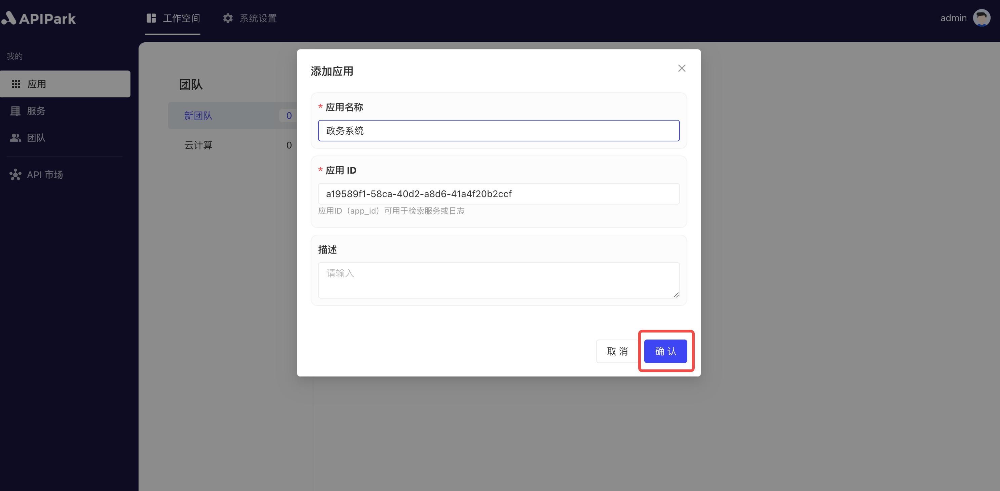

# Add Application

**Applications** are units through which service subscribers manage and organize API subscriptions. Each subscriber can create and manage multiple applications, and perform operations on API services on an application basis. This setup allows for flexible management of API subscriptions and calls across different projects or business lines.

## Demonstration

### Add Application

1. Click on `Workspace` -> `My` -> `Applications` to access the application list.

  

2. Select the team for which you want to add an application, and click `Add Application`. 

  

3. Enter the application information in the pop-up box. After completing the form, click `Confirm`.

  

### 