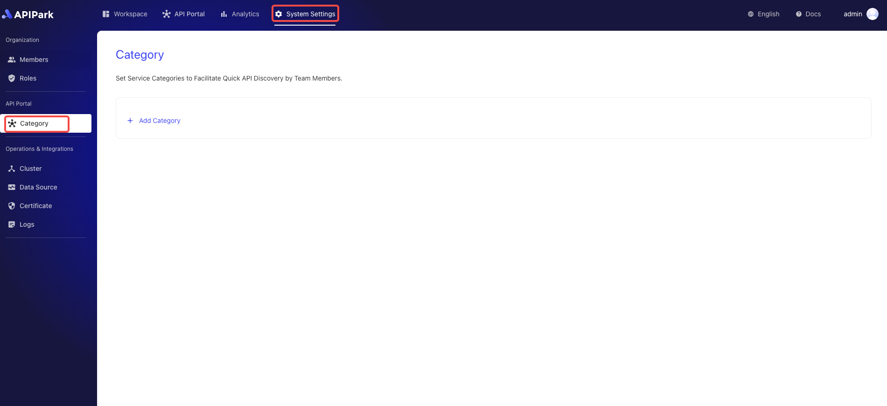
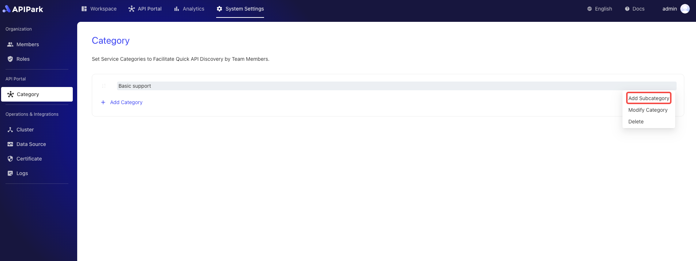
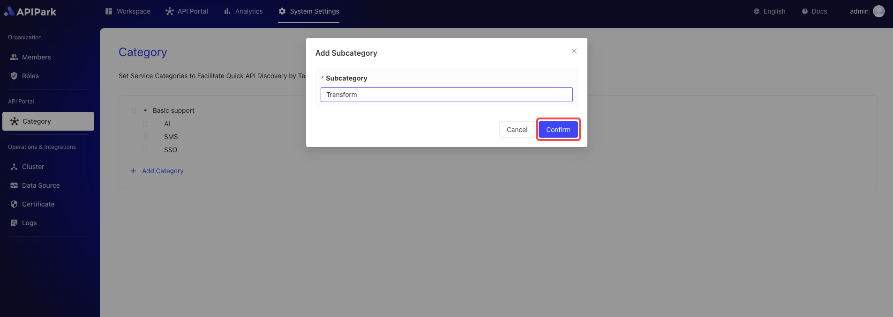
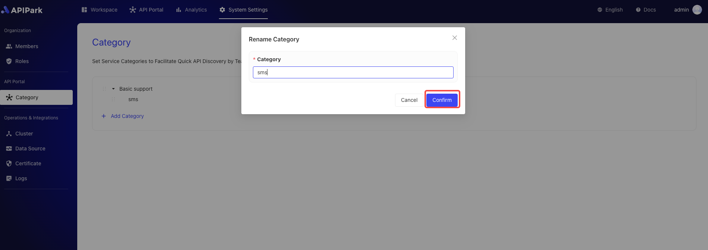
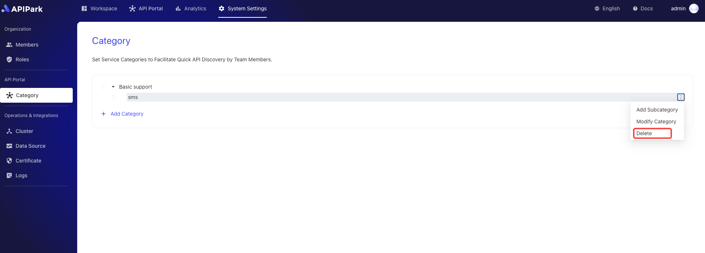

# Service Category Management

Set optional category tags for APIs to enable team members to quickly find and use the required APIs in the API marketplace.

Through a clear multi-level category structure, API discoverability and organization are enhanced, helping teams develop and maintain more efficiently, improving overall work efficiency and collaboration.

:::tip
When a service needs to be displayed in the service market, at least one category must be bound to it.
:::

## Operational Demonstration

### Add a Category

1. Click `System Settings` -> `API Portal -> `Category` to enter the service category list page.

   

2. Click `Add Category`.

  

3. Enter the category name in the pop-up box and click `Confirm`.

  

### Add a Subcategory

1. Click the menu button behind the category, and then click `Add Subcategory`.

  

2. Enter the subcategory name in the popup box, and then click `Confirm`.

  

### Edit Category Name

1. Click the menu button behind the category, and then click `Modify Category`.

  

2. Enter the new category name in the popup box, and then click `Confirm`.

  
 

### Delete a Category

1. Click the menu button behind the category, and then click `Delete`.

  

2. Click `Confirm` in the popup box.

  

### Change Category Order

Drag the sorting button in front of the category. 

  
