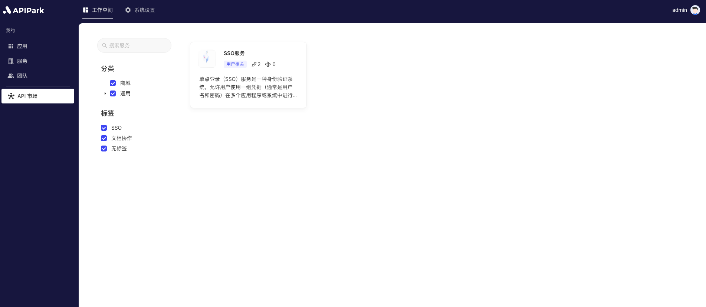

# API Marketplace

The APIPark service marketplace is a centralized platform for showcasing and managing all available API services. It provides developers with a unified interface to browse, search, and subscribe to various API services. The goal of the service marketplace is to simplify the discovery and usage of APIs, enabling developers to easily find and integrate the APIs they need.

## **Main Features**

**Service Categorization**:

* Services are organized into different categories, such as industry, functionality, or use case, allowing users to quickly find relevant services.

**Search Functionality**:

* Provides powerful search features for users to quickly find required API services using keywords.

**Subscription Management**:

* Users can view and manage their subscribed API services and request new subscriptions.
* An approval process is in place to ensure subscription requests are evaluated before becoming effective.

**Service Details**:

* Each service includes detailed information, such as functionality descriptions, usage methods, example code, and usage limitations, helping users quickly understand and utilize the API.

## **Use Cases**

* **Developer Integration**: Developers can use the service marketplace to find and integrate required API services, accelerating the application development process.
* **Enterprise Application**: Enterprises can subscribe to and manage various API services through the service marketplace to enhance the interoperability of business systems.
* **Partners**: Partners can publish and promote their own API services through the service marketplace, expanding business cooperation channels.

The service marketplace is an essential component of the open API platform, linking service providers and subscribers to promote the exchange and utilization of API services, offering strong support to developers and enterprises.

## Feature Display
### Service List

  

### Service Details

  