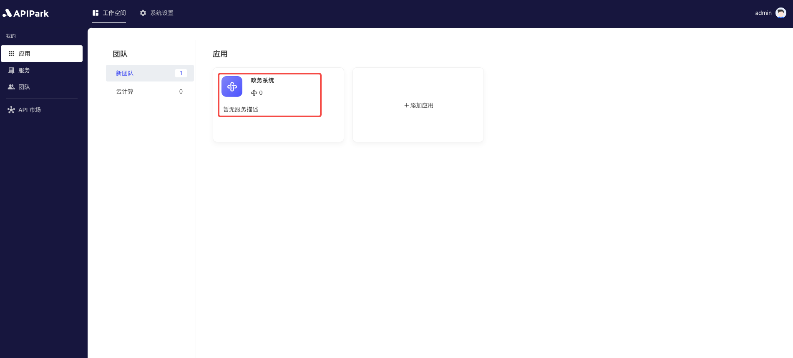
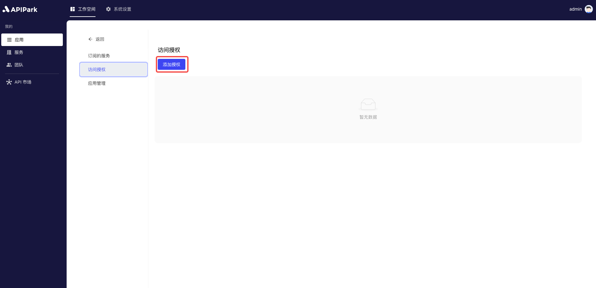

# Access Authorization

In `APIPark`, subscribers subscribe to services as applications. Each application has its own access authorization management. Once a subscription request is approved, users can use the application's access authorization information (such as API keys or tokens) to call the subscribed services. This ensures that when an application calls an API, it complies with security policies, preventing unauthorized access and ensuring the safety and stability of the service.

## Operational Demonstration

### Configuring Access Authorization

1. Select the application that needs access authorization configuration, and click to enter the details page.

  

2. Click on `Access Authorization` to enter the authorization list page, and click the `Add Authorization` button.

  

3. Choose an authentication method and fill in the relevant information. As shown, we select Basic Authentication:

  

Moreover, the open platform currently supports multiple authentication methods such as `Apikey`, `JWT`, `AK/SK`, **etc.**

For different types of authentication methods, the common configuration fields are as follows:

<table><thead><tr><th width="182">Field Name</th><th>Description</th></tr></thead><tbody><tr><td>Name</td><td>Authentication identifier, a meaningful name is recommended</td></tr><tr><td>Parameter Location</td><td>The parameter location where the authentication information is transmitted, supporting Query and Header.</td></tr><tr><td>Parameter Key</td><td>Defines from which Key to obtain the parameter value.</td></tr><tr><td>Expiration Time</td><td>The expiration time of the authentication; if not set, it never expires.</td></tr><tr><td>Hide Authentication Information</td><td>When forwarding to the upstream service, whether to hide the authentication fields.</td></tr></tbody></table>

For more details on using authentication, click the tutorials below:

* [APIKey](apikey.md)
* [Basic Authorization](basic-auth.md)
* [AK/SK](aksk.md)
* [JWT](jwt.md)