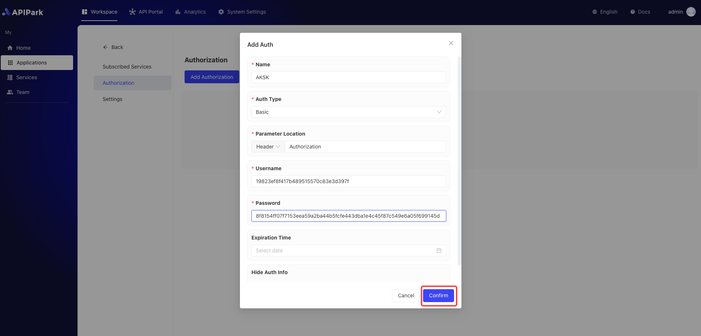

# AK/SK

`APIPark` provides an AK/SK (Access Key/Secret Key) authentication mechanism designed to offer secure identity verification and access control for API calls.

## **What is AK/SK Authentication?**

AK/SK authentication is a security mechanism based on a pair of keys (access key and secret key) used to authenticate users. This mechanism ensures that only authorized users can access specific APIs and resources.

* **AK (Access Key)**: The access key uniquely identifies the identity of the caller.
* **SK (Secret Key)**: The secret key is used in conjunction with the access key to sign and verify requests.

## Advantages

* When calling an API, users need to use the SK to sign the request to ensure its integrity and authenticity.
* Upon receiving the request, the server will use the same SK to verify the request, ensuring it has not been tampered with and is from a legitimate user.

## Operational Demonstration

1. When configuring authentication, select `AkSk` as the authentication type and fill in the authentication details:

  

**Configuration Description**

| Field Name    | Description                                      |
| ------------- | ------------------------------------------------ |
| Parameter Location | The location in the request where authentication is checked, supports Header, Query, Body |
| Parameter Name | Name of the parameter                            |
| AK            | Access Key                                       |
| SK            | Access Secret Key                                |
| Expiration    | User expiration time, perpetual if not filled, precise to the day |
| Hide Authentication Info | Whether to hide user information when forwarding to upstream services |

**Overview of AK/SK Procedure**

The client-side AK/SK signature and request process overview:

1. Construct a canonical request. Assemble the request content to be sent according to agreed rules with the API Gateway to ensure consistent use of request content for client-side signature and API Gateway background authentication.
2. Create a string-to-sign using canonical requests and other information.
3. Calculate the signature using the AK/SK and the string-to-sign.
4. Add the generated signature information to the HTTP request as a header or query string parameter.

**Instructions**

**1. Construct a Canonical Request**

To proceed with signing and authentication in AK/SK mode, you must first standardize the request content before signing. Ensuring the client and API Gateway adopt the same request standards allows for corresponding signature results for identical HTTP requests, completing identity validation.

The HTTP request canonical pseudo-code is as follows:

```
CanonicalRequest =
      HTTPRequestMethod + '\n' +
      CanonicalURI + '\n' +
      CanonicalQueryString + '\n' +
      CanonicalHeaders + '\n' +
      SignedHeaders + '\n' +
      HexEncode(Hash(RequestPayload))
```

Assume the **original request** is as follows:

```
GET http://www.demo.com/demo/login?parm1=value1&parm2= HTTP/1.1
Host: www.demo.com
X-Gateway-Date: 20200605T104456Z
```

**1、HTTPRequestMethod: Construct the HTTP request method, ending with a newline character.**

The HTTP request method, such as GET, PUT, POST, etc.

Construction example:

```
GET
```

**2、CanonicalURI: Add the canonical URI parameter, ending with a newline character.**

1. The canonical URI, i.e., request resource path, is the URI-encoded absolute path portion of the URI.
2. Standardize the URI path according to RFC 3986, remove redundant and relative path parts, and URI-encode every section within the path. If the URI path does not end with '/', append '/' to the end.

Note:

> When calculating the signature, the URI must end with '/'. When sending the request, it may not end with '/'. 

Construction example:

```
GET
/demo/login/
```

**3、CanonicalQueryString: Add the standardized query string, ending with a newline character.**

1. A query string is a series of query parameters. If there are no query parameters, it is an empty string, meaning the standardized request is an empty line.

2. The standardized query string must meet the following requirements:

   1. URI-encode the name and value of each parameter according to the following rules: do not perform URI-encoding on any non-reserved characters defined by RFC 3986, including: A-Z, a-z, 0-9, -, _, ., and ~.
   2. Percentage-encode all non-reserved characters using %XY, where X and Y are hexadecimal characters (0-9 and A-F). For example, a space character must be encoded as %20, and extended UTF-8 characters must be in the format "%XY%ZA%BC".

3. For each parameter, append "URI-encoded parameter name=URI-encoded parameter value." If there is no parameter value, replace it with an empty string, but do not omit '='. For example, below are two parameters, with the second parameter parm2 having an empty value.

   ```
   parm1=value1&parm2=
   ```

4. Sort the parameter names in ascending alphanumeric order. For instance, a parameter name starting with a capital letter 'F' comes before one starting with a lowercase 'b'.

5. Construct the canonical query string starting from the first sorted parameter name.

Construction example:

```
GET
/demo/login/
parm1=value1&parm2=
```

**4、CanonicalHeaders: Add the canonical headers, ending with a newline character.**

1. Canonical headers refer to the set of HTTP headers included in the authentication request. The headers must contain `X-Gateway-Date`, which is used to validate the signing time, formatted in the ISO8601 UTC timestamp format: YYYYMMDDTHHMMSSZ.
2. Canonical headers comprise multiple request headers: CanonicalHeadersEntry0 + CanonicalHeadersEntry1 + ..., each in the format of Lowercase(HeaderName) + ‘:’ + Trimall(HeaderValue) + ‘\n’.
3. Convert header names to lowercase and remove leading and trailing spaces.
4. Sort the header names in ascending alphanumeric order.

Note:

* Lowercase indicates converting all characters to lowercase letters.
* Trimall represents removing redundant spaces before and after the values.
* The last request header will carry a newline character, which, coupled with the newline character of the canonical headers, results in a blank line.

> For example, the original headers:
>
> ```
> Host: www.demo.com\n
> Content-Type: application/json;charset=utf8\n
> My-header1:    a   b   c  \n
> X-Gateway-Date:20200605T104456Z\n
> My-Header2:    "x   y   \n
> ```
>
> Change the header names to lowercase, sort them by alphanumeric order, and remove spaces around the values. The resulting canonical headers:
>
> ```
> content-type:application/json;charset=utf8\n
> host:www.demo.com\n
> my-header1:a   b   c\n
> my-header2:"x   y\n
> x-gateway-date:20200605T104456Z\n
> ```

Construction example:

```
GET
/demo/login/
parm1=value1&parm2=
content-type:application/json
host:www.demo.com
x-gateway-date:20200605T104456Z
```

**5、SignedHeaders: Add the signed headers declaration, ending with a newline character.**

1. The list of request headers to be signed. By adding this header, inform the API Gateway which headers in the request are part of the signing process and which can be ignored by the API Gateway during request verification. `X-Gateway-Date` must be a signed header.
2. Signed headers must meet the following criteria: convert signed header names to lowercase, sort them by alphanumeric order, and separate them with a semicolon ‘;’. SignedHeaders = Lowercase(HeaderName0) + ‘;’ + Lowercase(HeaderName1) + “;” + …

Assuming three headers participate in signing: Content-Type, Host, X-Gateway-Date, the signed headers will be:

```
SignedHeaders=content-type;host;x-gateway-date
```

Construction example:

```
GET
/demo/login/
parm1=value1&parm2=
content-type:application/json
host:www.demo.com
x-gateway-date:20200605T104456Z

content-type;host;x-gateway-date
```

For specific examples of adding headers to requests, refer to **Step Four: Add Signature Information to Request Headers**.

**6、RequestPayload: Use the SHA 256 hashing function on the body of the HTTP or HTTPS request to create a hash value.**

1. The request body. The body requires two layers of transformation: HexEncode(Hash(RequestPayload)), where Hash represents the function generating the message digest, currently supporting the SHA-256 algorithm. HexEncode refers to the Base-16 encoding function returning the digest in lowercase letters. For instance, HexEncode(“m”) returns “6d” rather than “6D”. Every input byte is represented by two hexadecimal characters. a. In cases of "RequestPayload==null", use an empty string ”” for computing.

This example uses the GET method, resulting in an empty body. The hashed body (empty string) is:

```
e3b0c44298fc1c149afbf4c8996fb92427ae41e4649b934ca495991b7852b855
```

Construction example:

```
GET
/demo/login/
parm1=value1&parm2=
content-type:application/json
host:www.demo.com
x-gateway-date:20200605T104456Z

content-type;host;x-gateway-date
e3b0c44298fc1c149afbf4c8996fb92427ae41e4649b934ca495991b7852b855
```

At this point, the construction of the canonical request is complete.

**7、Hash the constructed canonical request using the SHA 256 algorithm, the same algorithm used for hashing RequestPayload.**

The hashed canonical request must be represented in lowercase hexadecimal string form.

Algorithm pseudo-code:

```
Lowercase(HexEncode(Hash.SHA256(CanonicalRequest)))
```

Example of the hashed canonical request:

```
1ace9c4e12e4e322a506e3866a6e81e62c8f9ae674aca7966a55b9c6deb6ea00
```

**2. Creating a String to Sign**

After constructing and hashing the canonical request, it, with the signing algorithm and timestamp, makes the string to be signed.

```
StringToSign =
    Algorithm + \n +
    RequestDateTime + \n +
    HashedCanonicalRequest
```

1. Algorithm: The signing algorithm, HMAC-SHA256 for SHA 256.
2. RequestDateTime: The request timestamp, aligning with the `X-Gateway-Date` header value, formatted as YYYYMMDDTHHMMSSZ.
3. HashedCanonicalRequest: The hashed canonical request.

The resulting string to sign from the above example:

```
HMAC-SHA256
20200605T104456Z
1ace9c4e12e4e322a506e3866a6e81e62c8f9ae674aca7966a55b9c6deb6ea00
```

**3. Calculate the Signature**

Use the SK (Access Secret Key) and the string to sign as inputs to the hash function to calculate the signature and convert the binary value to its hexadecimal form.

Pseudo-code:

```
signature = HexEncode(HMAC(Access Secret Key, string to sign))
```

1. HMAC stands for key-related hash computation, HexEncode indicates converting to hexadecimal.
2. Access Secret Key: Signing key.
3. string to sign: The created string for signing.

Suppose the Access Secret Key is 8f8154ff07f7153eea59a2ba44b5fcfe443dba1e4c45f87c549e6a05f699145d, then the computed signature is:

```
3909cd0042fed21287e64b2436adb10ad12894c9beeb69f932efee872fd589ab
```

**4. Add Signature to the Request Headers**

After computing the signature, add it to the Authorization HTTP header for identity verification.

The pseudo-code for the Authorization header:

```
Authorization: algorithm Access=Access key, SignedHeaders=SignedHeaders, Signature=signature
```

Note, there is a space between 'algorithm' and 'Access', not a comma, whereas a comma is required between 'SignedHeaders' and 'Signature'.

The resulting Authorization header:

```
HMAC-SHA256 Access=19823ef8f417b489515570c83e3d397f, SignedHeaders=content-type;host;x-gateway-date, Signature=3909cd0042fed21287e64b2436adb10ad12894c9beeb69f932efee872fd589ab
```

Add this to the original HTTP request and send it to the API Gateway, which will complete the identity verification.

A complete request with signature:

```
GET /demo/login?parm1=value1&parm2= HTTP/1.1
Host: www.demo.com
Content-Type: application/json
x-gateway-date: 20200605T104456Z
Authorization: HMAC-SHA256 Access=19823ef8f417b489515570c83e3d397f, SignedHeaders=content-type;host;x-gateway-date, Signature=3909cd0042fed21287e64b2436adb10ad12894c9beeb69f932efee872fd589ab
```

Curl example:

```shell
curl -X GET "http://www.demo.com:6689/demo/login?parm1=value1&parm2=" -H "content-type: application/json" -H "x-gateway-date: 20200605T104456Z" -H "host: www.demo.com"  -H "Authorization-Type: AK/SK" -H "Authorization: HMAC-SHA256 Access=19823ef8f417b489515570c83e3d397f, SignedHeaders=content-type;host;x-gateway-date, Signature=3909cd0042fed21287e64b2436adb10ad12894c9beeb69f932efee872fd589ab" 
```

**The above request example is for demonstration purposes only.**