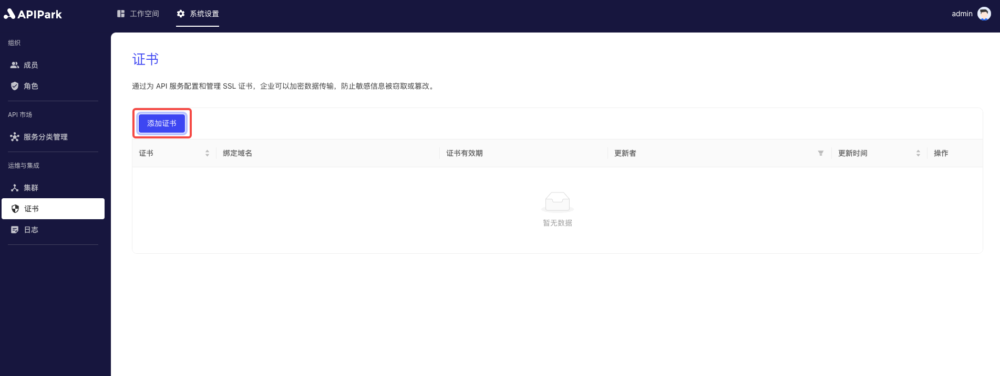
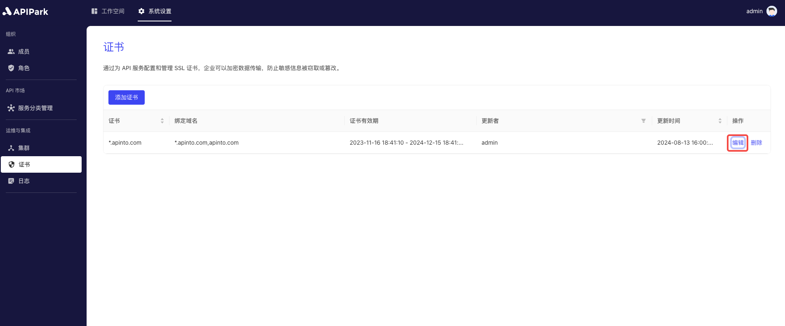

# Certificate

By configuring and managing SSL certificates for API services, businesses can encrypt data transmission to prevent sensitive information from being stolen or tampered with.

## Operation Demo

### Adding a Certificate
:::tip
Before adding a certificate, you need to [configure the cluster nodes](./cluster).
:::
1. Click on `System Certificate` -> `Operation & Integration` -> `Certificate` to enter the certificate list page.

  

2. Click `Add Certificate`.

  

3. In the pop-up box, upload the key (`.key`) and certificate (`.pem` or `.csr`) files.

  

After uploading, click `Confirm`.

### Modifying a Certificate
1. Click the `Edit` button next to the certificate you want to modify.

  

2. In the pop-up box, upload the key (`.key`) and certificate (`.pem` or `.csr`) files.

  

After uploading, click `Confirm`.

### Deleting a Certificate

1. Click the `Delete` button next to the certificate you want to modify.

  

2. In the pop-up box, click the `Confirm` button.

  