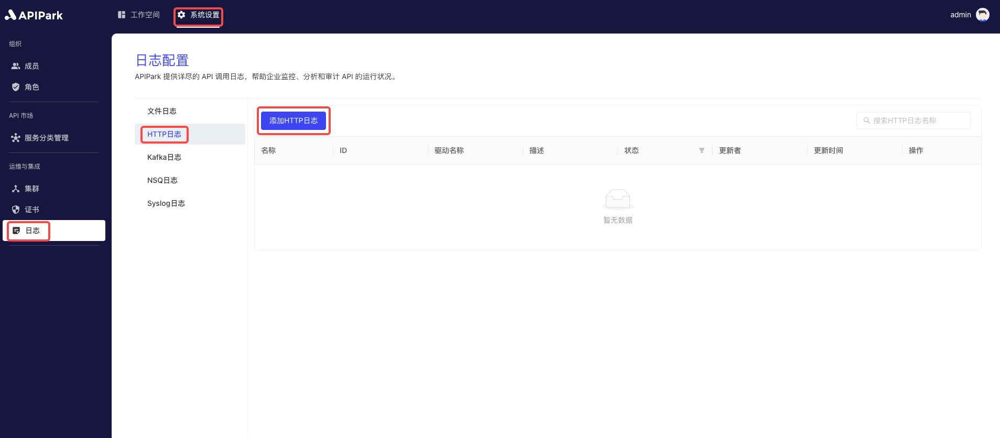

# HTTP Logs

Collect log information from the request gateway and output it to an **HTTP server**, making it easier for users to perform secondary operations such as log analysis.

## Features

The HTTP log plugin sends node access logs to the HTTP service interface via HTTP requests and has the following features:

* Supports multiple request methods, including **POST**, **PUT**, **PATCH**
* Supports custom request headers
* Supports log output format types
* Supports custom log formatting configuration

## Operation Demonstration

### Create a New HTTP Log Configuration

1. Click on `System Settings` -> `Operations and Integration` -> `Logs` -> `HTTP Logs` in the left navigation bar, and then click `Add HTTP Log`.

  

2. HTTP Log Configuration

  

**Configuration Description**:

| Field Name | Description |
| ---------- | ------------------------------------------------------------ |
| Request Method | The request method used when requesting the HTTP service interface, currently supports POST, PUT, PATCH |
| URL        | Full request path of the HTTP service interface |
| Request Header | Header information for the request, parameters required when requesting the HTTP service interface, such as authentication information. <br/>Please input in JSON format, data should be in `key-value` format, e.g., `{"from":"apinto"}` |
| Output Format | Log content output format, supports single line, Json format output |
| Format Configuration | Output format template, click [here](https://help.apinto.com/docs/formatter) for the tutorial |

**Format Configuration Example**

```json
{
   "fields": [
      "$time_iso8601",
      "$request_id",
      "@request",
      "@proxy",
      "@response",
      "@status_code",
      "@time"
   ],
   "request": [
      "$request_method",
      "$scheme",
      "$request_uri",
      "$host",
      "$header",
      "$remote_addr"
   ],
   "proxy": [
      "$proxy_method",
      "$proxy_scheme",
      "$proxy_uri",
      "$proxy_host",
      "$proxy_header",
      "$proxy_addr"
   ],
   "response": [
      "$response_header"
   ],
   "status_code": [
      "$status",
      "$proxy_status"
   ],
   "time": [
      "$request_time",
      "$response_time"
   ]
}
```

3. After clicking `Submit`, the HTTP log is added successfully.

  

### Launch

1. Click the `Launch` button after the configuration to be launched.

  