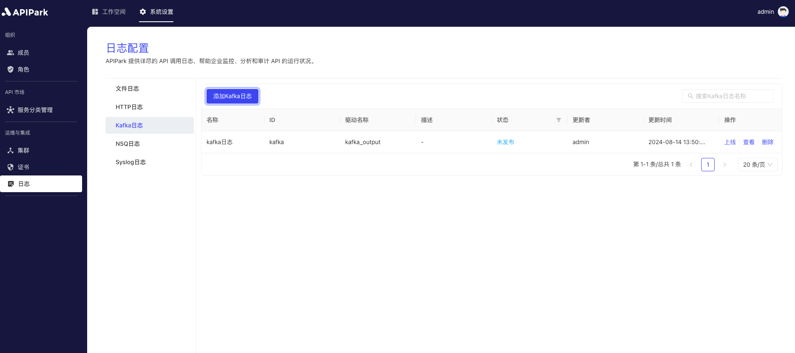

# Kafka Logs

Collect log information from request gateways and output it to `Kafka` to facilitate further operations, such as log analysis.

## Features

The ability to output log contents generated during program execution to a specified Kafka cluster queue.

## Operation Demonstration

### Create a New Kafka Log Configuration

1. Click on `Operations and Integration` -> `Log Configuration` -> `Kafka Logs` in the left navigation bar, then click on `Add Kafka Log`.

  

2. Fill in the Kafka log configuration.

  

**Configuration Explanation**:

<table><thead><tr><th width="208">Field Name</th><th>Description</th></tr></thead><tbody><tr><td>Version</td><td>Kafka version</td></tr><tr><td>Server Address</td><td>Addresses of Kafka services, multiple addresses are separated by commas</td></tr><tr><td>Topic</td><td>Topic information for Kafka service</td></tr><tr><td>Partition Type</td><td>Method for selecting partitions, default is hash; if `partition_key` is empty when hash is selected, it defaults to random selection</td></tr><tr><td>Partition</td><td>Specifies the partition number when Partition Type is set to manual</td></tr><tr><td>Partition Key</td><td>Specifies the hash value when Partition Type is set to hash</td></tr><tr><td>Request Timeout</td><td>Timeout period in seconds</td></tr><tr><td>Output Format</td><td>Format for log content output, supporting single-line and JSON format output</td></tr><tr><td>Formatting Configuration</td><td>Output format template, configuration tutorial can be found <a href="https://help.apinto.com/docs/formatter">here</a></td></tr></tbody></table>

**Sample Formatting Configuration**

```json
{
   "fields": [
      "$time_iso8601",
      "$request_id",
      "@request",
      "@proxy",
      "@response",
      "@status_code",
      "@time"
   ],
   "request": [
      "$request_method",
      "$scheme",
      "$request_uri",
      "$host",
      "$header",
      "$remote_addr"
   ],
   "proxy": [
      "$proxy_method",
      "$proxy_scheme",
      "$proxy_uri",
      "$proxy_host",
      "$proxy_header",
      "$proxy_addr"
   ],
   "response": [
      "$response_header"
   ],
   "status_code": [
      "$status",
      "$proxy_status"
   ],
   "time": [
      "$request_time",
      "$response_time"
   ]
}
```

3. Click `Submit` to complete adding the Kafka log configuration.

  

### Go Live

1. Click the `Go Live` button next to the configuration that is ready to be deployed.

  
