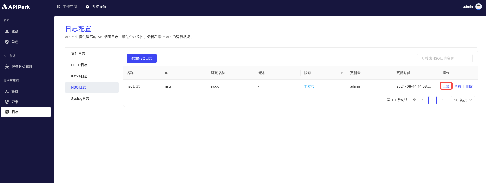

# NSQ Logs

## Introduction

Collect log information from the request gateway and output it to `NSQ` for easy secondary operations such as log analysis.

## Features

It can output the log content generated during the program run to a specified `NSQ Topic`.

* Supports entering multiple `NSQD` request addresses
* Supports log output format types
* Supports custom log format configuration

## Operation Demonstration

### Create a New NSQ Log Configuration

1. Click on `Operations and Integration` -> `Log Configuration` -> `NSQ Logs` in the left navigation bar, and then click `Add NSQ Log`.

  

2. Fill in the NSQ log configuration.

  

**Configuration Description**:

| Field Name   | Description                                                 |
| ------------ | ------------------------------------------------------------ |
| NSQD Address List | List of addresses where NSQD provides TCP services. Multiple addresses are supported. |
| Topic        | NSQD's Topic information                                     |
| Auth Secret  | The authentication key information for accessing NSQD        |
| Output Format| The format for the output log content, supporting single line and JSON formats |
| Format Configuration | Output format template, configuration tutorial [click here](https://help.apinto.com/docs/formatter) for more information |

**Sample Format Configuration**

```json
{
   "fields": [
      "$time_iso8601",
      "$request_id",
      "@request",
      "@proxy",
      "@response",
      "@status_code",
      "@time"
   ],
   "request": [
      "$request_method",
      "$scheme",
      "$request_uri",
      "$host",
      "$header",
      "$remote_addr"
   ],
   "proxy": [
      "$proxy_method",
      "$proxy_scheme",
      "$proxy_uri",
      "$proxy_host",
      "$proxy_header",
      "$proxy_addr"
   ],
   "response": [
      "$response_header"
   ],
   "status_code": [
      "$status",
      "$proxy_status"
   ],
   "time": [
      "$request_time",
      "$response_time"
   ]
}
```

3. Click `Submit` to complete the NSQ log configuration.

  

### Go Live
1. Click the `Go Live` button next to the configuration that is ready to go live.

  