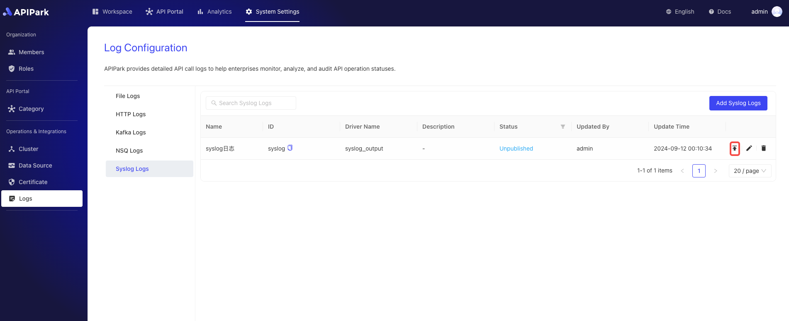

# Syslog Logs

## Introduction

Collect log information from request gateways and output it to `Syslog`.

## Features

Capable of outputting log content generated during program execution to a remote Syslog server.

* Supports various request protocols, including TCP, UDP, UNIX
* Allows setting log levels for Syslog output
* Supports different output log format types
* Provides customization options for log formatting configuration

## Operation Demo

### Creating a New Syslog Log Configuration

1. Click on `Operations & Integration` -> `Log Configuration` -> `Syslog Log` in the left navigation bar, and then click `Add Syslog Log`.

  

2. Fill in the Syslog log configuration by section.

  


**Configuration Explanation**:

| Field Name   | Description                                                  |
| ------------ | ------------------------------------------------------------ |
| Network Protocol   | The protocol for requesting the Syslog service, supporting TCP, UDP, UNIX                     |
| Server Address | The address of the Syslog service                                             |
| Log Level   | Syslog output log level, supporting ERROR, WARN, INFO, DEBUG, TRACE      |
| Output Format   | The format of the output log content, supporting single line or JSON format                     |
| Formatting Configuration | Output format template, configuration guide [click here](https://help.apinto.com/docs/formatter) to jump |

**Formatting Configuration Example**

```json
{
   "fields": [
      "$time_iso8601",
      "$request_id",
      "@request",
      "@proxy",
      "@response",
      "@status_code",
      "@time"
   ],
   "request": [
      "$request_method",
      "$scheme",
      "$request_uri",
      "$host",
      "$header",
      "$remote_addr"
   ],
   "proxy": [
      "$proxy_method",
      "$proxy_scheme",
      "$proxy_uri",
      "$proxy_host",
      "$proxy_header",
      "$proxy_addr"
   ],
   "response": [
      "$response_header"
   ],
   "status_code": [
      "$status",
      "$proxy_status"
   ],
   "time": [
      "$request_time",
      "$response_time"
   ]
}
```


### Go Live

1. Click the `Go Live` button behind the configuration to be launched.

  
