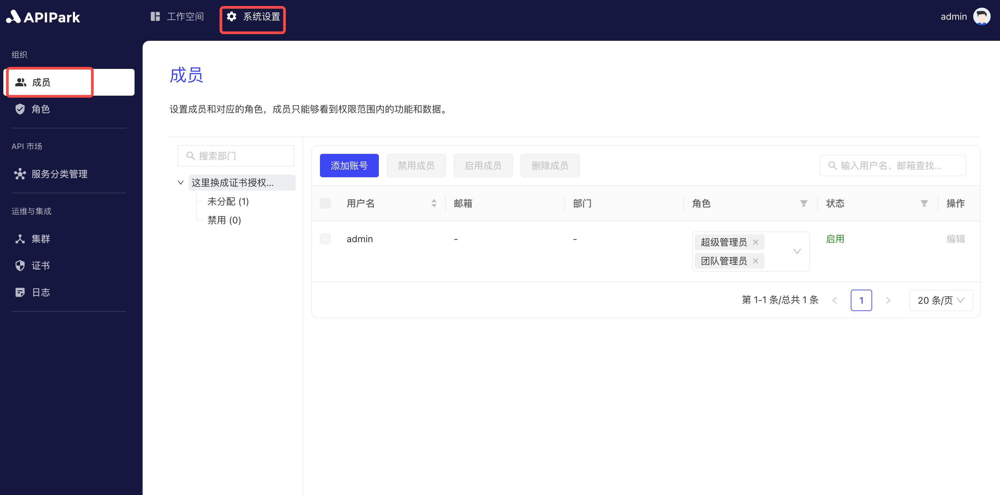
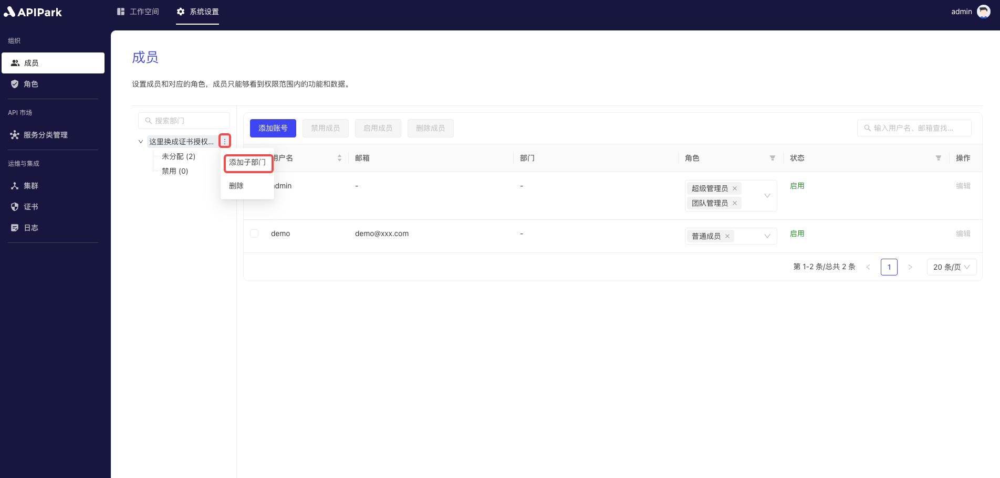
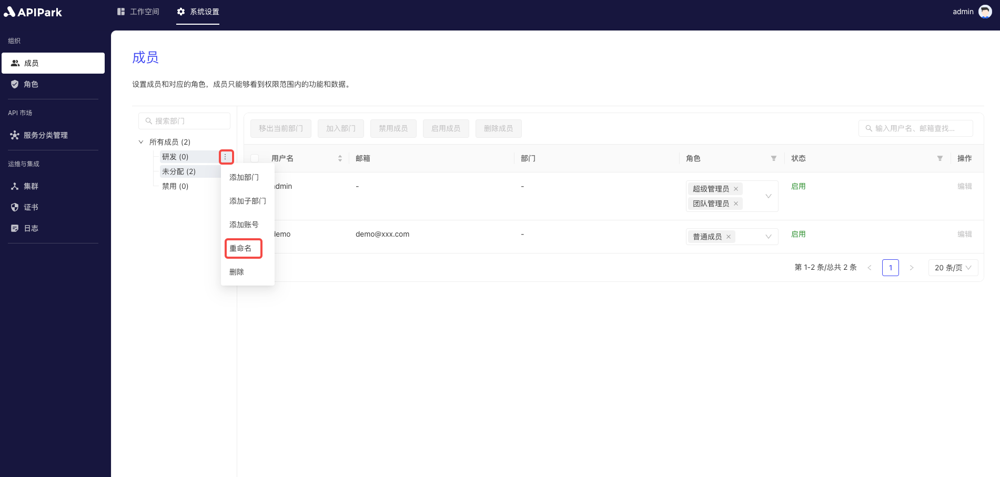
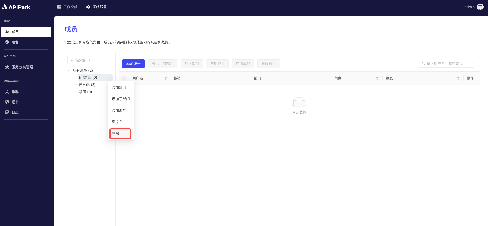
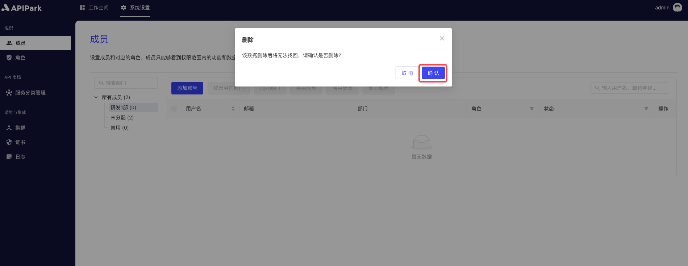
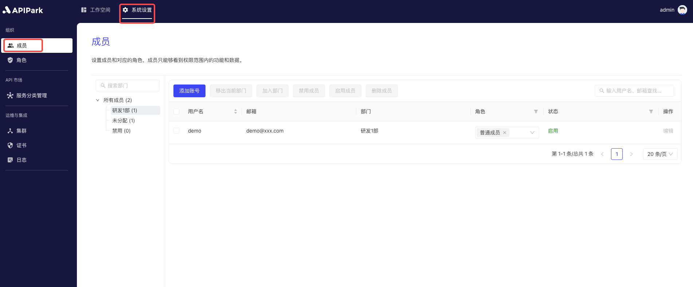

# Members

## Introduction
The member management module is a key component of the API Open Platform System, specifically designed for managing user accounts and organizational structures. This module provides a range of functionalities to ensure efficient and orderly member management within the system.

## Function Description:

1. **Create New Account**:
   - Administrators can create new user accounts.
   - When creating a new account, basic information such as username, email, department, etc., can be set.
   
2. **Enable/Disable Members**:
   - Administrators can enable or disable member accounts.
   - The enable function ensures members have normal access to system resources.
   - The disable function quickly restricts access when a member leaves or no longer needs access, ensuring system security.
   
3. **Organizational Structure Management**:
   - Supports viewing and editing company organizational structures.
   - Administrators can create, modify, and delete departments to ensure the structure is accurate and timely updated.
   
4. **Member Assignment**:
   - Members can be assigned to different departments to reflect their actual work positions and responsibilities.
   - Supports batch operations for administrators to adjust departmental affiliations of multiple members at once.
   - Provides search and filter functions for quickly locating and assigning members.
   - Assigns user roles to ensure each member can only access and operate within their permission range.

## Operation Demo

### Add Department/Sub-department

1. Click `System Settings` -> `Organization` -> `Members` to enter the member list page.

  

2. Click the menu button at the end of the department list and select `Add Sub-department`.

  

3. Enter the department name in the pop-up box and click `Confirm` after completion.

  

### Rename Department Name

1. Click `System Settings` -> `Organization` -> `Members` to enter the member list page.

  

2. Click the menu button at the end of the department list and select `Rename`.

  

3. Enter the department's name in the pop-up box and click `Confirm`.

  

### Delete Department

1. Click `System Settings` -> `Organization` -> `Members` to enter the member list page.

  

2. Click the menu button at the end of the department list and select `Delete`.

  

3. Click `Confirm` in the pop-up box.

  

### Add Account

1. Click `System Settings` -> `Organization` -> `Members` to enter the member list page.

  

2. Click the `Add Account` button.

  

3. Fill in the `Username`, `Email`, `Department` information in the pop-up box, and click Confirm after completion.

  

After adding an account, a `Regular Member` system role is automatically assigned.

### Join Department

1. Click `System Settings` -> `Organization` -> `Members` to enter the member list page.

  

2. Select a member and click `Join Department`.

  

### Remove from Current Department

1. Click `System Settings` -> `Organization` -> `Members` to enter the member list page.

  

2. Select the member you need to remove from the department and click `Remove from Current Department`.

  

3. Click `Confirm` in the pop-up box.

  

### Enable Member

1. Click `System Settings` -> `Organization` -> `Members` to enter the member list page.

  

2. Select the member you want to enable and click `Enable Member`.

  

### Disable Member

1. Click `System Settings` -> `Organization` -> `Members` to enter the member list page.

  

2. Select the member you want to disable and click `Disable Member`.

  

### Delete Member

1. Click `System Settings` -> `Organization` -> `Members` to enter the member list page.

  

2. Select the member you want to delete and click `Delete Member`.

  

3. Click `Confirm` in the pop-up box.

  