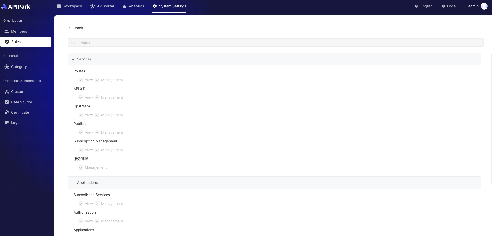
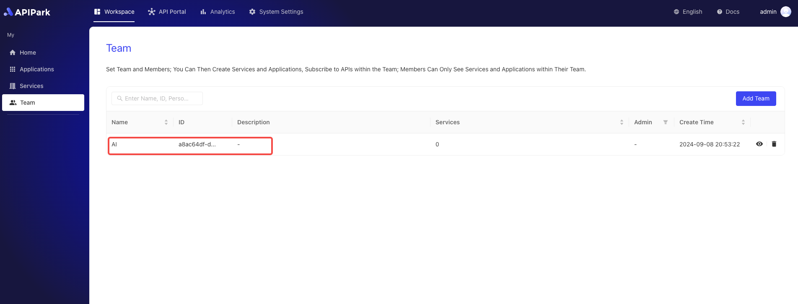
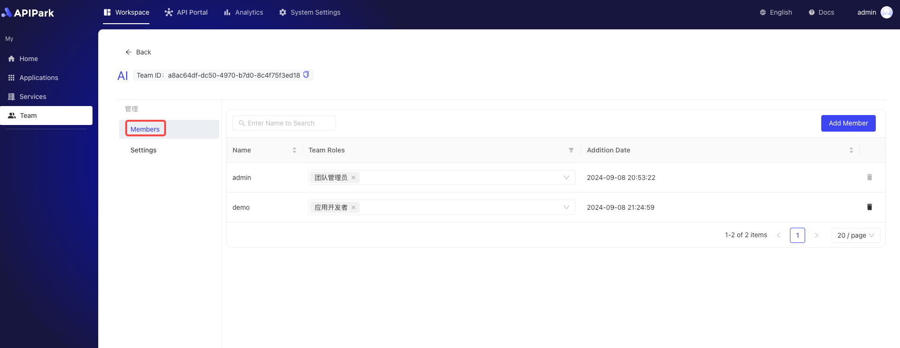

# Roles

The Roles module is used to define and manage system-level and team-level roles and their corresponding permissions. Through the Roles module, administrators can flexibly control users' access to system and team resources, ensuring security and efficient management.

## Function Description:

1. **System Level Roles Management**:
   - **Create and Edit Roles**: Administrators can create new system-level roles or edit existing ones. Each role can be configured with different permissions, covering various functions and resources within the system.
   - **Permission Configuration**: The permission configuration for system-level roles is flexible, supporting fine-grained permission allocation, ensuring that each role can only access resources and functions within its scope of responsibilities.
2. **Team Level Roles Management**:
   - **Create and Edit Team Roles**: Administrators can create and manage team-level roles based on team needs. Each team role can have different permission settings to meet internal team management requirements.
   - **Permission Configuration**: Team-level role permissions can be finely set for resources and functions within the team, ensuring efficient collaboration among team members.
3. **Permission Management**:
   - **Fine-Grained Permission Control**: Supports fine-grained permission control of system functions and data. Administrators can flexibly adjust each role's permissions according to actual needs.
4. **Role and Member Association**:
   - **System Role Assignment**: In the members management module, administrators can assign system-level roles to members, allowing them to access and operate system-level resources and functions.
   - **Team Role Assignment**: In the member management function of the team module, administrators can assign team-level roles to members, allowing them to have corresponding permissions within the team, supporting the efficient operation of the team.

## Role Permission Overview
### System Level Permissions

<table>
  <tr>
    <th></th>
    <th></th>
    <th></th>
    <th>Super Admin (Cannot be deleted or modified)</th>
    <th>Team Admin</th>
    <th>Ops Admin</th>
    <th>[Default] Regular Member</th>
  </tr>
  <tr>
    <th rowspan="6">Organization</th>
    <td rowspan="2">Members</td>
    <td>View</td>
    <td>✔</td>
    <td></td>
    <td></td>
    <td></td>
  </tr>
  <tr>
    <td>Manage</td>
    <td>✔</td>
    <td></td>
    <td></td>
    <td></td>
  </tr>
  <tr>
    <td rowspan="2">Teams</td>
    <td>View</td>
    <td>✔</td>
    <td>✔</td>
    <td></td>
    <td></td>
  </tr>
  <tr>
    <td>Manage</td>
    <td>✔</td>
    <td>✔</td>
    <td></td>
    <td></td>
  </tr>
  <tr>
    <td rowspan="2">Roles</td>
    <td>View System Roles</td>
    <td>✔</td>
    <td></td>
    <td></td>
    <td></td>
  </tr>
  <tr>
    <td>View Team Roles</td>
    <td>✔</td>
    <td>✔</td>
    <td></td>
    <td></td>
  </tr>
  <tr>
    <th rowspan="2">API Market</th>
    <td rowspan="2">Service Classification</td>
    <td>View</td>
    <td>✔</td>
    <td></td>
    <td>✔</td>
    <td></td>
  </tr>
  <tr>
    <td>Manage</td>
    <td>✔</td>
    <td>✔</td>
    <td></td>
    <td></td>
  </tr>
  <tr>
    <th rowspan="8">Operations</th>
    <td rowspan="2">Clusters</td>
    <td>View</td>
    <td>✔</td>
    <td></td>
    <td>✔</td>
    <td></td>
  </tr>
  <tr>
    <td>Manage</td>
    <td>✔</td>
    <td></td>
    <td>✔</td>
    <td></td>
  </tr>
  <tr>
    <td rowspan="2">SSL Certificates</td>
    <td>View</td>
    <td>✔</td>
    <td></td>
    <td>✔</td>
    <td></td>
  </tr>
  <tr>
    <td>Manage</td>
    <td>✔</td>
    <td></td>
    <td>✔</td>
    <td></td>
  </tr>
  <tr>
    <td rowspan="2">Logs</td>
    <td>View</td>
    <td>✔</td>
    <td></td>
    <td>✔</td>
    <td></td>
  </tr>
  <tr>
    <td>Manage</td>
    <td>✔</td>
    <td></td>
    <td>✔</td>
    <td></td>
  </tr>
  <tr>
    <td rowspan="2">OpenAPI</td>
    <td>View</td>
    <td>✔</td>
    <td></td>
    <td>✔</td>
    <td></td>
  </tr>
  <tr>
    <td>Manage</td>
    <td>✔</td>
    <td></td>
    <td>✔</td>
    <td></td>
  </tr>
  <tr>
    <td rowspan="2">Dashboard</td>
    <td>Operational View</td>
    <td>View</td>
    <td>✔</td>
    <td></td>
    <td>✔</td>
    <td></td>
  </tr>
  <tr>
    <td>System Topology</td>
    <td>View</td>
    <td>✔</td>
    <td></td>
    <td>✔</td>
    <td></td>
  </tr>
  <tr>
    <th rowspan="4">Workspace</th>
    <td>Applications</td>
    <td>View All Applications (if unchecked, only view joined ones)</td>
    <td>✔</td>
    <td>✔</td>
    <td>✔</td>
    <td></td>
  </tr>
  <tr>
    <td>Services</td>
    <td>View All Services (if unchecked, only view joined ones)</td>
    <td>✔</td>
    <td>✔</td>
    <td>✔</td>
    <td></td>
  </tr>
  <tr>
    <td>Teams</td>
    <td>View All Teams (if unchecked, only view joined ones)</td>
    <td>✔</td>
    <td>✔</td>
    <td>✔</td>
    <td></td>
  </tr>
  <tr>
    <td>API Market</td>
    <td>View</td>
    <td>✔</td>
    <td>✔</td>
    <td>✔</td>
    <td>✔</td>
  </tr>
</table>

### Team Level Permissions

<table>
  <tr>
    <th></th>
    <th></th>
    <th></th>
    <th>Team Admin</th>
    <th>Service Admin</th>
    <th>Service Developer</th>
    <th>Application Admin</th>
    <th>[Default] Application Developer</th>
  </tr>
  <tr>
    <th rowspan="10">Service</th>
    <td rowspan="2">API</td>
    <td>View</td>
    <td>✔</td>
    <td>✔</td>
    <td>✔</td>
    <td></td>
    <td></td>
  </tr>
  <tr>
    <td>Manage</td>
    <td>✔</td>
    <td>✔</td>
    <td>✔</td>
    <td></td>
    <td></td>
  </tr>
  <tr>
    <td rowspan="2">Upstream</td>
    <td>View</td>
    <td>✔</td>
    <td>✔</td>
    <td>✔</td>
    <td></td>
    <td></td>
  </tr>
  <tr>
    <td>Manage</td>
    <td>✔</td>
    <td>✔</td>
    <td>✔</td>
    <td></td>
    <td></td>
  </tr>
  <tr>
    <td rowspan="2">Release</td>
    <td>View</td>
    <td>✔</td>
    <td>✔</td>
    <td>✔</td>
    <td></td>
    <td></td>
  </tr>
  <tr>
    <td>Manage</td>
    <td>✔</td>
    <td>✔</td>
    <td>✔</td>
    <td></td>
    <td></td>
  </tr>
  <tr>
    <td rowspan="2">Subscriber Management (includes subscriber approval and list)</td>
    <td>View</td>
    <td>✔</td>
    <td>✔</td>
    <td></td>
    <td></td>
    <td></td>
  </tr>
  <tr>
    <td>Manage</td>
    <td>✔</td>
    <td>✔</td>
    <td></td>
    <td></td>
    <td></td>
  </tr>
  <tr>
    <td>Service Management</td>
    <td>Manage (add, modify, delete services)</td>
    <td>✔</td>
    <td>✔</td>
    <td></td>
    <td></td>
    <td></td>
  </tr>
  <tr></tr>
  <tr>
    <th rowspan="6">Applications</th>
    <td rowspan="2">Subscribe to Services</td>
    <td>View</td>
    <td>✔</td>
    <td></td>
    <td></td>
    <td>✔</td>
    <td>✔</td>
  </tr>
  <tr>
    <td>Manage</td>
    <td>✔</td>
    <td></td>
    <td></td>
    <td>✔</td>
    <td>✔</td>
  </tr>
  <tr>
    <td rowspan="2">Access Authorization</td>
    <td>View</td>
    <td>✔</td>
    <td></td>
    <td></td>
    <td>✔</td>
    <td>✔</td>
  </tr>
  <tr>
    <td>Manage</td>
    <td>✔</td>
    <td></td>
    <td></td>
    <td>✔</td>
    <td></td>
  </tr>
  <tr>
    <td rowspan="2">Application Management</td>
    <td>Manage (add, modify, delete applications)</td>
    <td>✔</td>
    <td></td>
    <td></td>
    <td>✔</td>
    <td></td>
  </tr>
  <tr></tr>
  <tr>
    <th rowspan="4">Team</th>
    <td rowspan="2">Members</td>
    <td>View</td>
    <td>✔</td>
    <td>✔</td>
    <td>✔</td>
    <td>✔</td>
    <td>✔</td>
  </tr>
  <tr>
    <td>Manage</td>
    <td>✔</td>
    <td></td>
    <td></td>
    <td></td>
    <td></td>
    <td></td>
  </tr>
  <tr>
    <td rowspan="2">Team Management</td>
    <td>View</td>
    <td>✔</td>
    <td></td>
    <td></td>
    <td></td>
    <td></td>
  </tr>
  <tr>
    <td>Manage (modify, delete team)</td>
    <td>✔</td>
    <td></td>
    <td></td>
    <td></td>
    <td></td>
    <td></td>
  </tr>
</table>

## Operational Demonstrations
### Viewing Role Permissions
1. Click `System Settings` -> `Organization` -> `Roles` to enter the roles list page.

  

2. Click the `View` button next to the role to enter the role details page.

  

  

### Modifying Member System Roles
:::tip
The current user needs to have system-level permissions: `Organization` -> `Members` -> `Manage`.
:::

1. Click `System Settings` -> `Organization` -> `Members` to enter the members list page.

  

2. Click on the member whose role needs to be changed to assign member roles.

  

### Modifying Team Roles for Members
:::tip

1. The current user has joined the team;

2. The current user needs to have team-level permissions within the team: `Team` -> `Members` -> `Manage`

:::

1. Click `Workspace` -> `My` -> `Teams` to enter the teams list page.

  

2. Select the team to enter the team inner page.

  

3. Click `Members` to enter the members list.

  

4. Click on the member whose role needs to be changed to assign member roles.

  
