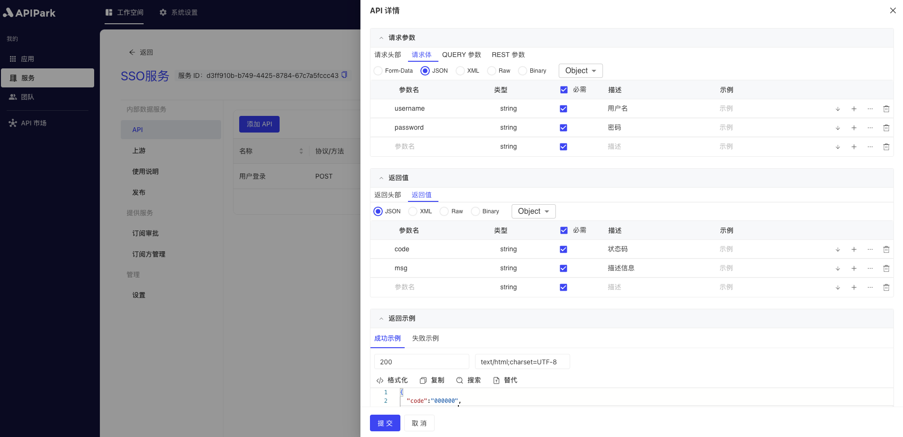

# API

The API is a core component of `APIPark`, connecting various services and applications through standardized interfaces to enable data sharing and function calls. The API provides an efficient, secure, and scalable communication mechanism that supports a microservices architecture, enhances user experience, and fosters innovation and development.

In **APIPark**, the API is not just a bridge between systems but a fundamental part of building an efficient, flexible, and innovative ecosystem. With well-designed and managed APIs, the platform can achieve high interoperability and scalability, offering excellent service experiences to users and developers.

## Operational Demonstration
### Adding an API

1. Select the service you need to configure and enter the internal page of the service.

2. Click `Add API`.

3. Enter the API information in the popup box, and click `Submit` after completing the form.

**Field Descriptions**

| Field Name          | Description                                                                         |
|---------------------|-------------------------------------------------------------------------------------|
| API Name            | The name used to identify the API; can be named based on its purpose or function.   |
| Description         | A detailed description of the API.                                                  |
| Request Method      | The request method used by the client.                                              |
| Request Path        | The path of the client's request, concatenated with the service prefix.             |
| Advanced Matching   | More custom routing rules for client requests.                                      |
| Upstream Path       | The path forwarded to the upstream, which may differ from the request path.         |
| Request Timeout     | The timeout for forwarding the request to the upstream service, in milliseconds.    |
| Retry Count         | The number of times the request is resent in case of a timeout.                     |

### Editing an API

1. Click the `Edit` button next to the API you want to edit.

2. Fill in the API document information, including parameters and return values required by the client request.

This documentation will be displayed in the service plaza for subscribers to understand how to call the subscribed API.

### Copying an API

1. Click the `Copy` button next to the API you want to copy.

2. Fill in the basic API information in the popup box.

**Field Descriptions**

| Field Name          | Description                                                                               |
|---------------------|-------------------------------------------------------------------------------------------|
| API Name            | The name used to identify the API; can be named based on its purpose or function.         |
| Description         | A detailed description of the API.                                                        |
| Request Method      | The request method used by the client.                                                    |
| Request Path        | The path for client requests, concatenated with the organization and service prefixes.    |
| Advanced Matching   | More custom routing rules for client requests.                                            |

After completing the form, click `Confirm`. 

The newly added API will be globally deduplicated based on the request method and request path. Apart from the basic information, other settings such as forwarding path, retry count, API documentation, and so on will be copied to the new API.

### Deleting an API
1. Click the `Delete` button next to the API you want to delete.

2. Click `Confirm` in the popup box.

