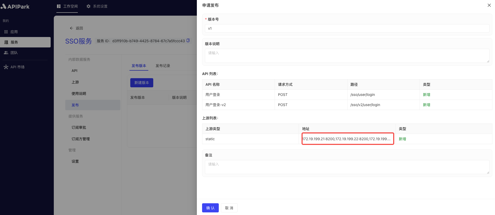
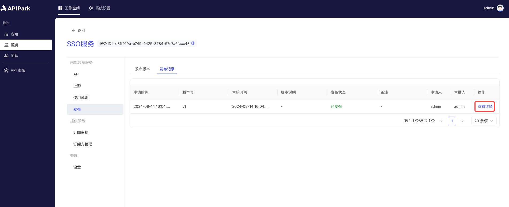

# Release

Releasing a service version is an important step in deploying the most recently configured services and APIs to the production environment, ensuring that subscribers have access to the latest published version of the API when calling. By releasing service versions, you can uniformly manage the lifecycle of APIs and services, ensuring that the latest configurations can take effect timely, maintaining system stability and reliability.

After executing the release operation, if the current service is an `external service`, it will be displayed in the service marketplace.

## Operation Demonstration
### Release Version

1. Select the service you need to configure and enter the service's internal page.

2. Click on `Release`, then click on `Create New Version`.

  

3. In the pop-up box, enter the version description information, and then click `Confirm` once finished.

  

### View Release Records

1. Click on `Release Records` to enter the records list page.

  

2. Click the `View Details` button next to the record.

  

  
