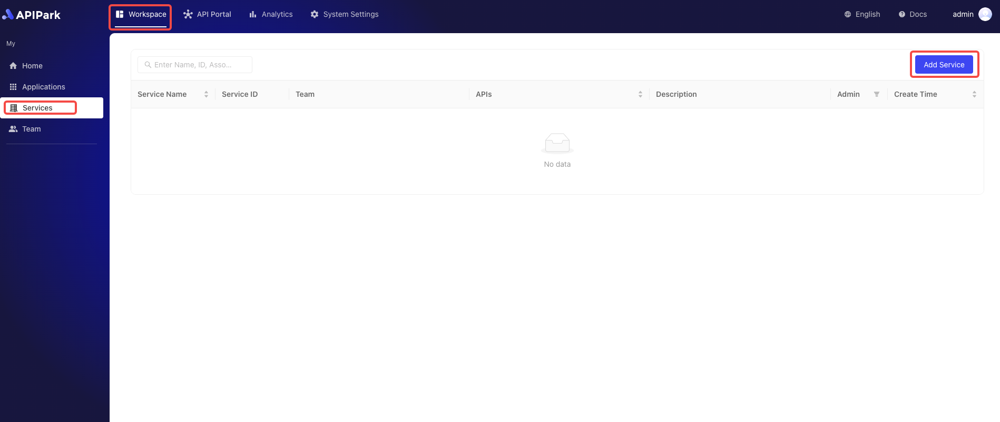
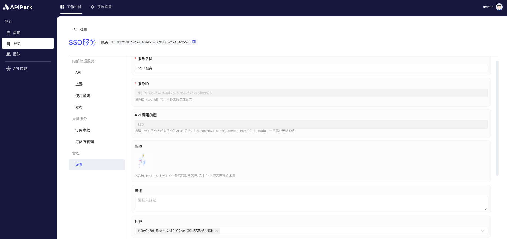

# Service Management

The Service Management module allows teams to create and manage multiple services, with each service able to bind multiple APIs. Users can showcase services in the Service Plaza for subscribers to subscribe to as needed. After a subscription application is submitted, it requires administrator approval, and once approved, subscribers can access all APIs under that service. Through this module, teams can manage and publish APIs flexibly, and subscribers can conveniently access the required services, enhancing API usage efficiency and team collaboration capabilities.

:::tip
Services displayed in the Service Plaza must meet the following conditions:

* The service type is **external service**;
* The service contains **APIs**; if none exist, please refer to the tutorial [Add API](./api.md#add-api);
* The service has an **upstream** configured; if not configured, please refer to the tutorial [Configure Upstream](./upstream.md#configure-upstream);
* The service is **published**; if not published, please refer to the tutorial [Release Version](./release.md#release-version).
:::

## Operation Demonstration
### Add Service
1. Click `Workspace` -> `My` -> `Service` to enter the service list page and then click `Add Service`.

  

2. Enter the service information in the popup form.

  

**Field Description**

<table><thead><tr><th width="169">Field Name</th><th>Description</th></tr></thead><tbody><tr><td>Service Name</td><td>The name used to identify and describe the service.</td></tr><tr><td>Service ID</td><td>The Service ID is used to uniquely identify the service, ensuring accurate differentiation between different services during management and operations. It is used internally and during invocation and is difficult to change.</td></tr><tr><td>API Call Prefix</td><td>The URL prefix used when calling the API of the service. It is used to manage and route API requests uniformly, ensuring requests are correctly directed to the target service. The prefix should be associated with the service name and easy to remember and use.</td></tr><tr><td>Description</td><td>Records and displays detailed information and function description of the service.</td></tr><tr><td>Responsible Team</td><td>The team responsible for managing and maintaining the service.</td></tr><tr><td>Icon</td><td>This icon will be displayed in the Service Plaza.</td></tr><tr><td>Tags</td><td>Custom tags for the service to facilitate quick searching by subscribers.</td></tr><tr><td>Service Type</td><td>If it's an <b>External Service</b>, subscribers can obtain and apply for subscriptions through the Service Plaza. Once approved by the provider, calls can be initiated. If it's an <b>Internal Service</b>, call permissions can only be allocated by the provider through distribution to subscribers.</td></tr><tr><td>Service Category</td><td>Select the service category that will be displayed in the Service Plaza.</td></tr></tbody></table>

Here, we choose `External Service` as the service type and select the `Service Category`. Once completed, click `Submit`.

If there is no service category, please refer to the tutorial [Add Service Category](../../quick/provider/catalogue.md#operation-demonstration).

### Edit Service Information
1. Select the service you want to edit and click to enter the service details page.

  

2. Click `Settings` to enter the service settings page.

  

3. After modifying, click `Save`.

  

### Edit Service Description
:::tip
If the service is an external service and is published, this service description will be displayed in the API market's service details and updated in real-time.
:::
1. Click `Instructions`.

  

After editing, click save.

### Delete Service

1. After entering the service settings page, click `Delete Service` at the bottom.

  

2. In the popup box, click `Confirm`.

  