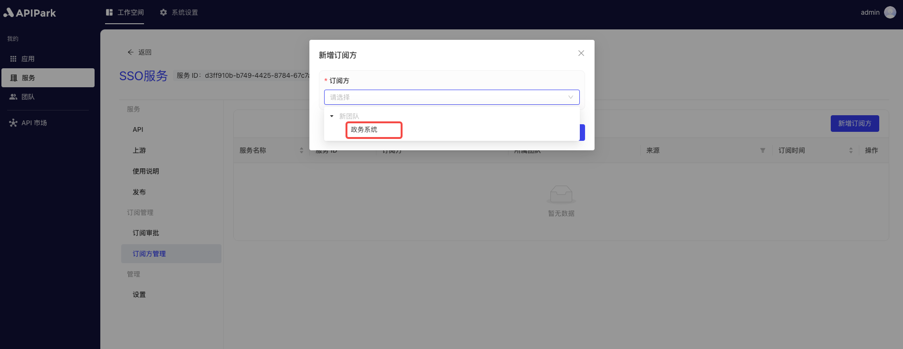

# Subscriber Management

Subscriber management aims to help platform administrators effectively manage and control API users and their access rights. Through subscriber management, developers and administrators can clearly understand who is using the APIs, which APIs are being used, and how they are being used, thereby ensuring the platform's security, controllability, and efficiency.

### **Main Features**

**Subscription Application and Approval**:

* **Application Process**: Subscribers (applications) can apply for the required API services through the platform by filling in the necessary information and purpose of use.
* **Approval Process**: Administrators can review subscription applications to ensure that only eligible subscribers can access the APIs, thus ensuring API security.

**Add/Delete Subscribers**:

* **Create Subscriber**: Administrators can manually add new subscribers, specifying the APIs and permissions they can access.
* **Revoke Permissions**: When a subscriber no longer needs to use the APIs or their behavior does not comply with the usage regulations, administrators can revoke their access rights.

### **Use Cases**

* **Internal Enterprise Management**: Multiple departments or teams within an enterprise use APIs. Through subscriber management, you can effectively manage and control the API usage of each department or team.
* **Partner Management**: Enterprises share APIs with multiple partners. By managing subscribers, you can ensure that partners' usage behavior is compliant and secure.

## Operation Demonstration

### Add Subscriber
1. Select the service that needs approval and enter the internal page of the service.

2. Click on `Subscriber Management` to enter the subscriber list and click `Add Subscriber`.

  

3. In the pop-up window, select the `application` that needs to subscribe to the current service and click `Confirm`.

  

### Delete Subscriber

1. Click `Delete` behind the subscriber you want to delete.

  

2. Click `Confirm` in the pop-up window.

  