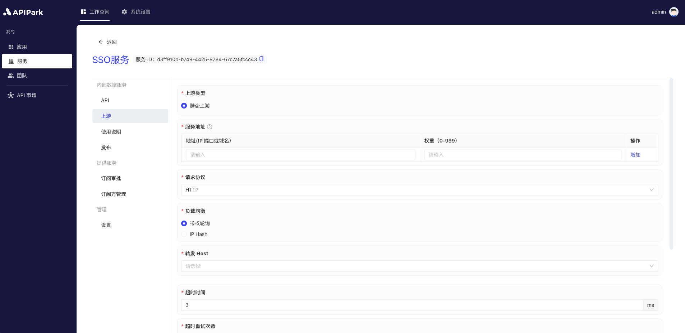
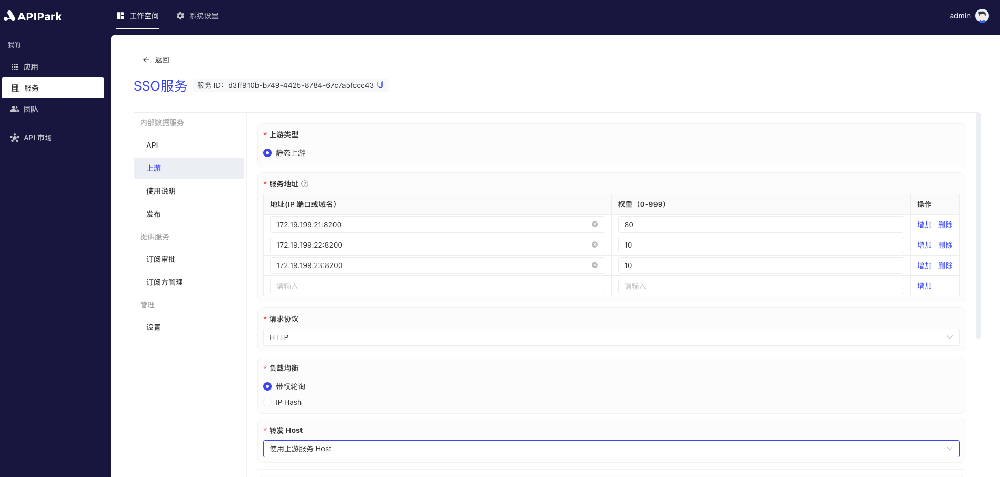

# Upstream

In `APIPark`, "upstream" refers to the backend servers or services where API requests are ultimately routed. Upstream generally includes the actual business logic, data storage, and applications that process API requests. In an API gateway architecture, the gateway receives and processes requests from clients, then forwards these requests to upstream servers for specific processing, retrieves the response, and returns it to the clients.

Configuring upstream is a key step in an API open platform to ensure that API requests can be correctly routed to backend services. Upstream configuration involves defining and managing target addresses, load balancing strategies, and failover mechanisms to ensure high availability and performance of services.

## Operation Demonstration
### Configuring Upstream

1. Select the service you need to configure and enter the internal page of the service.

2. Click on `Upstream` to enter the upstream configuration page.

3. Configure the upstream information, and after configuration, click `Save`.

  

  

**Field Explanation**

<table><thead><tr><th width="169">Field Name</th><th>Description</th></tr></thead><tbody><tr><td>Upstream Type</td><td>The type of upstream service, currently only supporting <code>static upstream, i.e., services with fixed IP/domain + port number.</code></td></tr><tr><td>Service Address</td><td>The access address of the upstream service. Multiple upstream addresses can be entered with each having a configured weight.</td></tr><tr><td>Request Protocol</td><td>The protocol to request upstream services, currently only supporting HTTP/HTTPS.</td></tr><tr><td>Load Balancing</td><td>Load balancing algorithm, currently supporting weighted round-robin and IP hash.</td></tr><tr><td>Forward Host</td><td>The Host value used when requesting the upstream service, with three options:  <b>Pass through client request Host:</b> Under this strategy, the gateway or proxy server does not alter the Host header information in the request. It directly passes the original Host header from the client (the requesting party) to the upstream service (the actual server providing the service). This allows the upstream service to recognize the original source domain name of the request, thereby providing customized content or executing specific logic based on the original Host header of the request.  <b>Use upstream service Host:</b>  In this strategy, the gateway or proxy server replaces the original Host header in the request with a Host header configured with the upstream service. This is commonly used to route the request to a specific backend service, regardless of the Host header in the client's request. This can simplify the configuration of upstream services as they do not need to concern themselves with the Host header information of incoming requests.  <b>Rewrite Host:</b>  This strategy involves modifying the Host header in the request, changing it to a specific value. This can be used in various scenarios, such as when the request needs to be routed to a different domain name, or when ensuring the request aligns with specific format or security requirements. Rewriting the Host header can provide greater flexibility but may also lead to unexpected behaviors, especially if the client relies on the original Host header for certain operations.</td></tr><tr><td>Timeout</td><td>The timeout for requesting upstream, measured in ms.</td></tr><tr><td>Retry on Timeout</td><td>The number of times to retry requesting upstream if a timeout occurs. During a retry, if multiple service addresses are configured for the upstream, the gateway will retry with an address that has not been requested yet.</td></tr><tr><td>Rate Limiting</td><td>The allowable number of requests per second for the current upstream.</td></tr><tr><td>Forward Upstream Request Header</td><td>Request header information to be added or removed when requesting upstream. If not configured, the gateway forwards the request header to the upstream service as is.</td></tr></tbody></table>

Once filled in, click `Save`.