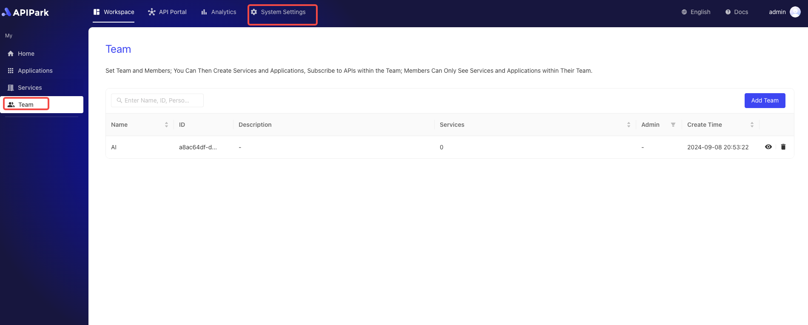

# Team Members

In the Members module, administrators can easily add or remove team members and assign appropriate permissions to each member, ensuring that they can only access and operate the sections they are authorized to.

The permissions setting feature makes team management more flexible and secure by assigning different access levels based on different roles, such as administrators, developers, viewers, etc. This not only improves work transparency and efficiency but also ensures the secure management of sensitive information.

## Operation Demonstration
### Adding a Member
:::tip
Members added to the team by default receive the `Application Developer` team role.
:::
1. Click `Workspace` -> `My` -> `Team` to enter the team list page.

  

2. Click the team where you want to add members to enter the team details page.

3. Click the `Members` tab and then click the `Add Member` button.

  

4. In the pop-up box, select the members you want to add to the team and move them to the right.

  

After completing the operation, click Confirm to finish.

