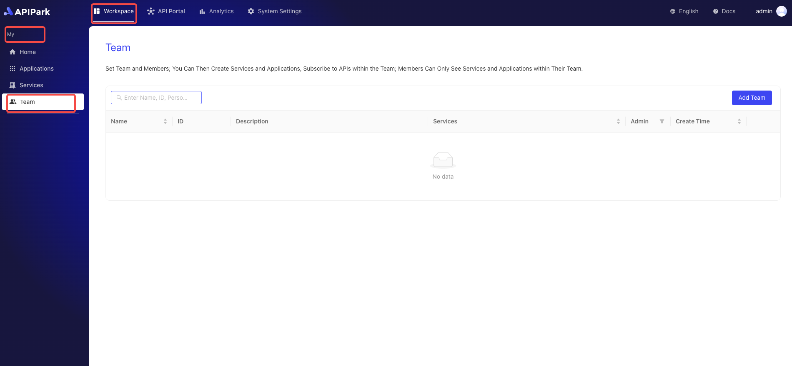
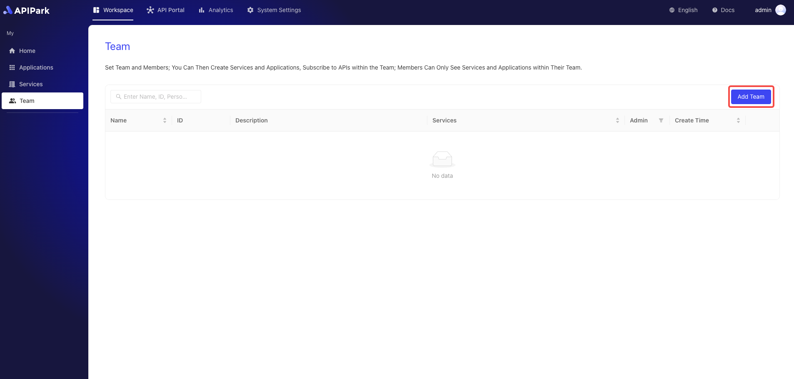

# Team Management

The team module in APIPark is an efficient collaboration tool designed to organize and manage services by teams. Through the team module, businesses can form different teams according to project needs, with each team able to independently manage its API services. The team module includes a member module for managing members who join the team.

## Operations Demonstration

### Create a New Team

1. Click `Workspace` -> `My` -> `Team` to enter the team list page.

  

2. Click the `Add Team` button.

   

3. Enter team information in the pop-up box and click `Confirm` after completing it.

**Field Descriptions**

<table><thead><tr><th width="203">Field Name</th><th>Description</th></tr></thead><tbody><tr><td>Team Name</td><td>An identifier to distinguish and identify different teams. The team name should be concise and clearly reflect the team's responsibilities and tasks.</td></tr><tr><td>Team ID</td><td>A unique identifier for the team, which can be customized.</td></tr><tr><td>Team Leader</td><td>Appoint the team leader. After creating the team, the leader will receive the team administrator role.</td></tr><tr><td>Description</td><td>Used to record and display detailed information and notes related to a specific team.</td></tr></tbody></table>

### Edit Team Configuration

1. Click the team you want to edit to enter the team settings interface.

  

2. Edit the team information and click save after editing.

  

### Delete Team
:::tip
Teams can be deleted through two entrances. If there are services in the team, the team cannot be deleted.
:::
1. Click delete in the team list

  

2. Click delete on the team settings page

  
