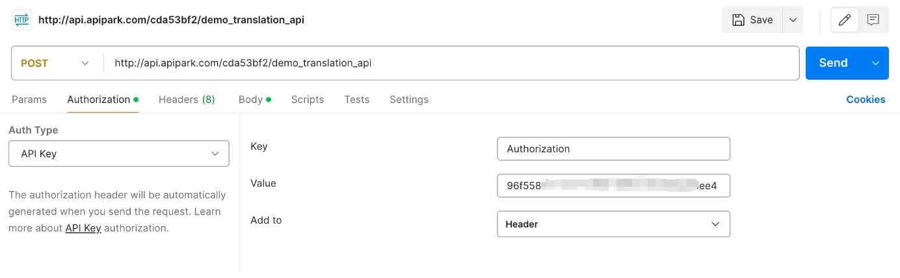

# Calling the API

## Prerequisites

Before making a call, the following conditions must be met:

- The **consumer** has created an **authorization certificate**. Learn more: [🔗 Consumers](consumers.md).
- The **consumer** has successfully subscribed to the service. Learn more: [🔗 API Portal](developer_portal.md).


## Example

😜 Suppose:

- The **consumer**'s **authorization certificate** is as follows:
  - **Authentication Type**: API Key
  - **Parameter Location**: Header
  - **Parameter Name**: Authorization
  - **Key**: 96f55...ee4
- The API endpoint for the **service** is: **http://api.apipark.com/cda53bf2/demo_translation_api**

  


You can use any of the following methods to call the service API.


### Postman or Other API Clients

In the API testing tool, add the Authorization parameter in the Header and set the parameter value to 96f55...ee4:




### cURL

Enter in the command line:

```sh
curl -X POST -H "Authorization: 96f55...ee4" \
-H "Content-Type: application/json" -d "request body content" \
http://api.apipark.com/cda53bf2/demo_translation_api
```