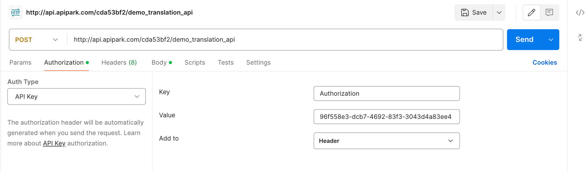
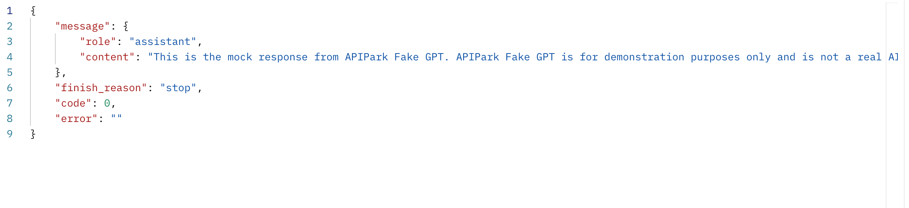

# Calling the API

Once approved, consumers can use the approved application information to call the subscribed service's API and obtain the actual results. This means that once a subscription request is approved, the user can securely access and use the service through the application's access authorization, perform relevant operations, and receive the corresponding data or feedback.

:::tip

Before calling, the following conditions need to be met:

1. The consumer has configured access authorization. If not, please refer to the guide [Configuring Access Authorization](./authorization/README.md).
2. The consumer has submitted a subscription request for the service the API belongs to. If not, please refer to the guide [Subscribing to Services](./consumers.md#订阅服务).
3. The subscription has been approved. If not, please contact the service provider for approval of the application. Refer to the guide [Consumer Review](./services/review_consumers.md#消费者审核).

:::

Assuming the authentication information configured in [Configuring Access Authorization](./authorization/README.md) is as follows:

  

The API call URL is `http://api.apipark.com/cda53bf2/demo_translation_api`:

  

The call parameters are:

  

You can use any of the following methods to call the service API.

<details>
<summary>CURL</summary>

Select a `server/virtual machine/PC` that can access the zone gateway node, and execute the following command:

```sh
curl -X POST -H "Authorization: 96f558e3-dcb7-4692-83f3-3043d4a83ee4" \
-H "Content-Type: application/json" -d "{\"messages\":[],\"variables\":{\"source_lang\":\"Chinese\",\"target_lang\":\"English\",\"text\":\"\"}}" \
http://api.apipark.com/cda53bf2/demo_translation_api
```

The call result is shown in the image below:
  

</details>

<details>
<summary>Postman</summary>

Fill in the authentication information, as shown below:

 

Fill in the request body information, as shown below:

  

The response result is shown below:

  
</details>  