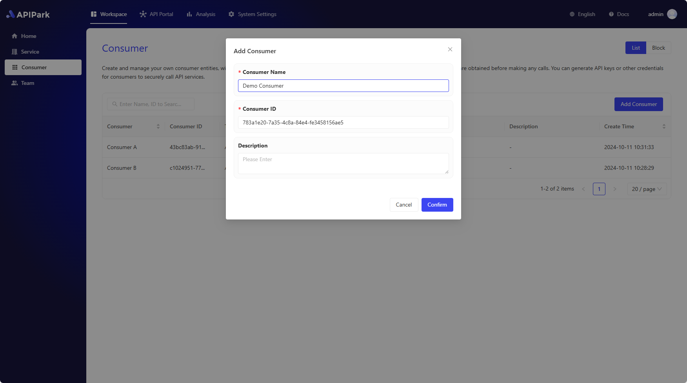
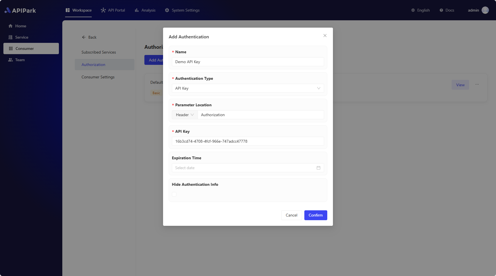

# Consumers
APIPark provides an **API portal** feature that allows users to publish services to the API portal, where they can be viewed, subscribed to, and invoked by other users.

In APIPark, a **Consumer** is an entity that **subscribes to services** and **calls APIs**. Consumers subscribe to services to gain the permissions needed to call the APIs within those services, ensuring data security and compliance with access permissions.

To ensure secure and standardized use of APIs and to reduce management costs, users need to create a **Consumer** first. After that, they subscribe to services using the consumer and then use the consumer's **credentials** to call the API.

## Creating a Consumer

Before subscribing to API services, you need to create a **Consumer**. A consumer is an entity that subscribes to services and calls APIs. Consumers obtain the permission to call the APIs within a service by subscribing to it, ensuring data security and compliance.

Go to the **Workspace** module, select **Consumers** from the sidebar, and then **Create Consumer**. Fill in the following:

- **Consumer Name**
- **Consumer ID**: A unique identifier for the consumer that cannot be changed once saved.
- **Description**

## Adding Credentials

APIPark uses **Credentials** to restrict **Consumers**' access to API resources, ensuring that only approved consumers or applications can access specific APIs.

Enter the management interface of **Consumers**, select **Credentials** from the sidebar, and click **Create Credential**. Fill in the following in the popup window:

- **Credential Name**: For easy management of the key, it's recommended to give it a clear and understandable name.
- **Authentication Type**: The method of authentication for the credential, including Basic Auth, API Key, JWT, AK/SK, etc. Each authentication method has different parameter fields and key rules.
- **Parameter Position**: The location where the key is filled in.
- **Key**: When requesting an API from APIPark, include the key in request parameters. To avoid data breaches, do not store keys in publicly accessible code.
- **Expiration Time**: Credentials are created with no expiration by default. If you want to create a temporary credential, such as one valid for only three months, you can specify an expiration date. If a request is made using an expired credential, APIPark will return a credential expiration error.
- **Hide Authentication Information**: By default, APIPark's API Gateway forwards the consumer's credentials to the upstream service, allowing it to perform secondary authorization verification. If this option is checked, APIPark will hide authentication information when forwarding requests.

## Subscribing to Services with a Consumer

To subscribe to services using a Consumer, please refer to [🔗 Subscribe to API Services](developer_portal.md).

## Calling APIs with a Consumer

To call a service's APIs, please refer to [🔗 Call API](call_api.md).