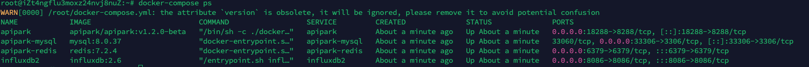
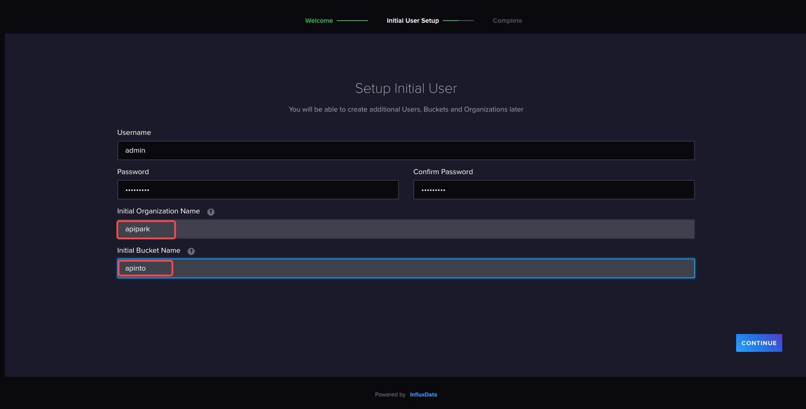
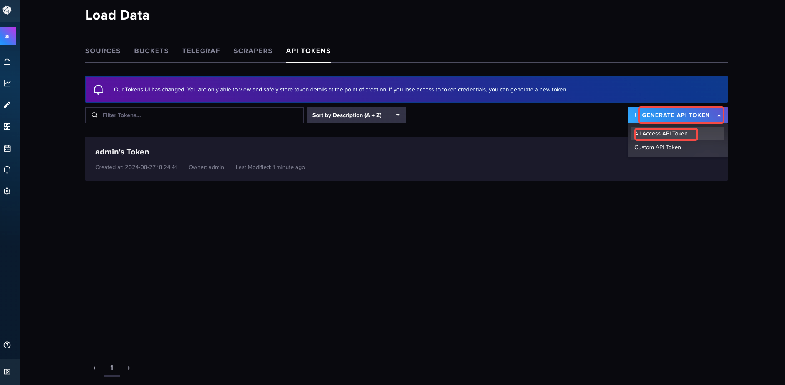

# Deploy APIPark
## Hardware Requirements

:::tip
Recommended Configuration:

- **CPU**: 8 cores
- **Memory**: 16GB
- **Disk Storage**: 200GB
- **Operating System**: Linux / Mac
- **System Architecture**: AMD64 / ARM64
  :::

:::note
Minimum Configuration:

- **CPU**: 2 cores
- **Memory**: 4GB
- **Disk Storage**: 200GB
- **Operating System**: Linux / Mac
- **System Architecture**: AMD64 / ARM64
  :::

## Program Dependencies

`APIPark` relies on `MYSQL, Redis, InfluxDB` databases. The required versions for these databases are:

<table><thead><tr><th width="184">Name</th><th>Version Requirement</th></tr></thead><tbody><tr><td>MYSQL</td><td>>=5.7.x</td></tr><tr><td>Redis</td><td>>=6.2.x</td></tr><tr><td>InfluxDB</td><td>>=2.6</td></tr></tbody></table>

## Deployment Methods

### Deploy using Script

:::note
Supported System List:

* CentOS 7.9 (representing 7.x)
* CentOS 8.5 (representing 8.x)
* Ubuntu 20.04
* Ubuntu 22.04
* Debian 12.4
* Alibaba Cloud Linux 3.2104
* Alibaba Cloud Linux 2.1903

Currently, the installations have only been tested for the above systems. If you need a one-click deployment for other systems, you can submit an [Issue](https://github.com/APIParkLab/APIPark/issues) to us.
:::

Enter the one-click deployment command:

```
curl -sSO https://download.apipark.com/install/quick-start.sh; bash quick-start.sh
```

Follow the prompts to deploy. After deployment is complete, deployment information will be displayed.

### Docker-Compose Deployment

:::note

To install APIPark using this method, you need to install [Docker](https://www.docker.com/) and [Docker Compose](https://docs.docker.com/compose/).

After the deployment, APIPark needs to bind with the API Gateway node to function. For detailed instructions, please refer to [Configure API Gateway](./system_setting/api_gateway_cluster.md).

:::

#### Deploy APIPark + API Gateway

1. Edit `config.yml`

```
vi config.yml
```

2. Modify the file configuration

```
version: 2
#certificate: # Directory for storing certificates
#  dir: /etc/apinto/cert
client:
  advertise_urls: # Broadcast address of open api service
    - http://{IP}:9400
  listen_urls: # Listening address of open api service
    - http://0.0.0.0:9400
  #certificate:  # Certificate configuration, allows using self-signed certificates with IP
  #  - cert: server.pem
  #    key: server.key
gateway:
  advertise_urls: # Broadcast address of forwarding service
    - http://{IP}:8099
    - https://{IP}:8099
  listen_urls: # Listening address of forwarding service
    - https://0.0.0.0:8099
    - http://0.0.0.0:8099
peer: # Configuration information for communication between cluster nodes
  listen_urls: # Node listening address
    - http://0.0.0.0:9401
  advertise_urls: # Broadcast address for node communication
    - http://{IP}:9401
  #certificate:  # Certificate configuration, allows using self-signed certificates with IP
  #  - cert: server.pem
  #    key: server.key
```

In the above configuration, `{IP}` is a variable and should be replaced with the **host IP** of the container. Suppose the host IP is `172.18.65.22`, then the configuration should be as follows:

```
version: 2
#certificate: # Directory for storing certificates
#  dir: /etc/apinto/cert
client:
  advertise_urls: # Broadcast address of open api service
    - http://172.18.65.22:9400
  listen_urls: # Listening address of open api service
    - http://0.0.0.0:9400
  #certificate:  # Certificate configuration, allows using self-signed certificates with IP
  #  - cert: server.pem
  #    key: server.key
gateway:
  advertise_urls: # Broadcast address of forwarding service
    - http://172.18.65.22:8099
    - https://172.18.65.22:8099
  listen_urls: # Listening address of forwarding service
    - https://0.0.0.0:8099
    - http://0.0.0.0:8099
peer: # Configuration information for communication between cluster nodes
  listen_urls: # Node listening address
    - http://0.0.0.0:9401
  advertise_urls: # Broadcast address for node communication
    - http://172.18.65.22:9401
  #certificate:  # Certificate configuration, allows using self-signed certificates with IP
  #  - cert: server.pem
  #    key: server.key
```

**Configuration Description**

| Field Name                | Description                                                  |
| :------------------------ | :----------------------------------------------------------- |
| version                   | Configuration version number, default is 2                  |
| client                    | openAPI configuration information                            |
| client -> listen_urls     | List of openAPI listening addresses, format: `{protocol}://{IP}:{port}` |
| client -> advertise_urls  | List of openAPI broadcast addresses, displayed in the console cluster node list, format: `{protocol}://{IP/domain}:{port}` |
| client -> certificate     | List of openAPI certificate information                      |
| gateway                   | Configuration information for forwarding proxy core program  |
| gateway -> listen_urls    | List of forwarding proxy core program listening addresses, format: `{protocol}://{IP}:{port}` |
| gateway -> advertise_urls | List of forwarding proxy core program broadcast addresses, displayed in the console cluster node list, format: `{protocol}://{IP/domain}:{port}` |
| peer                      | Configuration information for Raft nodes, used for configuration synchronization, joining the cluster, leaving the cluster, etc. |
| peer -> listen_urls       | List of Raft node listening addresses, format: `{protocol}://{IP}:{port}` |
| peer -> advertise_urls    | List of Raft node broadcast addresses, format: `{protocol}://{IP/domain}:{port}` |
| peer -> certificate       | List of Raft node certificate information                    |

3. Edit `docker-compose.yml` file

```bash
vi docker-compose.yml
```

4. Modify the file configuration

```
version: '3'
services:
  apipark-mysql:
    image: mysql:8.0.37
    privileged: true
    restart: always
    container_name: apipark-mysql
    hostname: apipark-mysql
    command:
      - "--character-set-server=utf8mb4"
      - "--collation-server=utf8mb4_unicode_ci"
    ports:
      - "33306:3306"
    environment:
      - MYSQL_ROOT_PASSWORD={MYSQL_PWD}
      - MYSQL_DATABASE=apipark
    volumes:
      - /var/lib/apipark/mysql:/var/lib/mysql
    networks:
      - apipark
  apipark:
    image: apipark/apipark:v1.2.0-beta
    container_name: apipark
    privileged: true
    restart: always
    networks:
      - apipark
    ports:
      - "18288:8288"
    depends_on:
      - apipark-mysql
    environment:
      - MYSQL_USER_NAME=root
      - MYSQL_PWD={MYSQL_PWD}
      - MYSQL_IP=apipark-mysql
      - MYSQL_PORT=3306                 #mysql port
      - MYSQL_DB="apipark"
      - ERROR_DIR=work/logs  # Directory for placing logs
      - ERROR_FILE_NAME=error.log          # Error log file name
      - ERROR_LOG_LEVEL=info               # Error log level, options: panic, fatal, error, warning, info, debug, trace. If unspecified or invalid, default is info
      - ERROR_EXPIRE=7d                    # Error log expiration time, default is in days, d|days, h|hours. Invalid configuration defaults to 7d
      - ERROR_PERIOD=day                   # Error log rotation period, supports only day, hour
      - REDIS_ADDR=apipark-redis:6379      # Redis cluster address, separated by commas
      - REDIS_PWD={REDIS_PWD}              # Redis password
      - ADMIN_PASSWORD={ADMIN_PASSWORD}
  influxdb2:
    image: influxdb:2.6
    privileged: true
    restart: always
    container_name: influxdb2
    hostname: influxdb2
    ports:
      - "8086:8086"
    volumes:
      - /var/lib/apipark/influxdb2:/var/lib/influxdb2
    networks:
      - apipark
  apipark-redis:
    container_name: apipark-redis
    image: redis:7.2.4
    hostname: apipark-redis
    privileged: true
    restart: always
    ports:
      - 6379:6379
    command:
      - bash
      - -c
      - "redis-server --protected-mode yes --logfile redis.log --appendonly no --port 6379 --requirepass {REDIS_PWD}"
    networks:
      - apipark
  apipark-apinto:
    image: eolinker/apinto-gateway
    container_name: apipark-apinto
    privileged: true
    restart: always
    command: 
      - ./start.sh
    ports:
      - "8099:8099"
      - "9400:9400"
      - "9401:9401"
    volumes:
      - /var/lib/apipark/apinto/data:/var/lib/apinto
      - /var/lib/apipark/apinto/log:/var/log/apinto
      - ${PWD}/config.yml:/etc/apinto/config.yml
    networks:
      - apipark
networks:
  apipark:
    driver: bridge
    ipam:
      driver: default
      config:
        - subnet: 172.100.0.0/24
```

In the above configuration, values within "{}" are variables. Descriptions of relevant variables are as follows:

- **MYSQL_PWD:** Initialization password for the MySQL database root user.
- **REDIS_PWD:** Redis password.
- **ADMIN_PASSWORD:** Initial password for APIPark Admin account.

Example of replaced configuration:

```
version: '3'
services:
  apipark-mysql:
    image: mysql:8.0.37
    privileged: true
    restart: always
    container_name: apipark-mysql
    hostname: apipark-mysql
    command:
      - "--character-set-server=utf8mb4"
      - "--collation-server=utf8mb4_unicode_ci"
    ports:
      - "33306:3306"
    environment:
      - MYSQL_ROOT_PASSWORD=123456
      - MYSQL_DATABASE=apipark
    volumes:
      - /var/lib/apipark/mysql:/var/lib/mysql
    networks:
      - apipark
  apipark:
    image: apipark/apipark:v1.2.0-beta
    container_name: apipark
    privileged: true
    restart: always
    networks:
      - apipark
    ports:
      - "18288:8288"
    depends_on:
      - apipark-mysql
    environment:
      - MYSQL_USER_NAME=root
      - MYSQL_PWD=123456
      - MYSQL_IP=apipark-mysql
      - MYSQL_PORT=3306                 #mysql port
      - MYSQL_DB="apipark"
      - ERROR_DIR=work/logs  # Directory for placing logs
      - ERROR_FILE_NAME=error.log          # Error log file name
      - ERROR_LOG_LEVEL=info               # Error log level, options: panic, fatal, error, warning, info, debug, trace. If unspecified or invalid, default is info
      - ERROR_EXPIRE=7d                    # Error log expiration time, default is in days, d|days, h|hours. Invalid configuration defaults to 7d
      - ERROR_PERIOD=day                   # Error log rotation period, supports only day, hour
      - REDIS_ADDR=apipark-redis:6379      # Redis cluster address, separated by commas
      - REDIS_PWD=123456                   # Redis password
      - ADMIN_PASSWORD=12345678
  influxdb2:
    image: influxdb:2.6
    privileged: true
    restart: always
    container_name: influxdb2
    hostname: influxdb2
    ports:
      - "8086:8086"
    volumes:
      - /var/lib/apipark/influxdb2:/var/lib/influxdb2
    networks:
      - apipark
  apipark-redis:
    container_name: apipark-redis
    image: redis:7.2.4
    hostname: apipark-redis
    privileged: true
    restart: always
    ports:
      - 6379:6379
    command:
      - bash
      - -c
      - "redis-server --protected-mode yes --logfile redis.log --appendonly no --port 6379 --requirepass 123456"
    networks:
      - apipark
  apipark-apinto:
    image: eolinker/apinto-gateway
    container_name: apipark-apinto
    privileged: true
    restart: always
    command: 
      - ./start.sh
    ports:
      - "8099:8099"
      - "9400:9400"
      - "9401:9401"
    volumes:
      - /var/lib/apipark/apinto/data:/var/lib/apinto
      - /var/lib/apipark/apinto/log:/var/log/apinto
      - ${PWD}/config.yml:/etc/apinto/config.yml
    networks:
      - apipark
networks:
  apipark:
    driver: bridge
    ipam:
      driver: default
      config:
        - subnet: 172.100.0.0/24
```

5. Start APIPark

```
docker-compose up -d
```

After execution, the following images will be displayed:


#### Independently Deploy APIPark

1. Edit `docker-compose.yml` file

```bash
vi docker-compose.yml
```

2. Modify the file configuration

```
version: '3'
services:
  apipark-mysql:
    image: mysql:8.0.37
    privileged: true
    restart: always
    container_name: apipark-mysql
    hostname: apipark-mysql
    command:
      - "--character-set-server=utf8mb4"
      - "--collation-server=utf8mb4_unicode_ci"
    ports:
      - "33306:3306"
    environment:
      - MYSQL_ROOT_PASSWORD={MYSQL_PWD}
      - MYSQL_DATABASE=apipark
    volumes:
      - /var/lib/apipark/mysql:/var/lib/mysql
    networks:
      - apipark
  apipark:
    image: apipark/apipark:v1.2.0-beta
    container_name: apipark
    privileged: true
    restart: always
    networks:
      - apipark
    ports:
      - "18288:8288"
    depends_on:
      - apipark-mysql
    environment:
      - MYSQL_USER_NAME=root
      - MYSQL_PWD={MYSQL_PWD}
      - MYSQL_IP=apipark-mysql
      - MYSQL_PORT=3306                 #mysql port
      - MYSQL_DB="apipark"
      - ERROR_DIR=work/logs  # Directory for placing logs
      - ERROR_FILE_NAME=error.log          # Error log file name
      - ERROR_LOG_LEVEL=info               # Error log level, options: panic, fatal, error, warning, info, debug, trace. If unspecified or invalid, default is info
      - ERROR_EXPIRE=7d                    # Error log expiration time, default is in days, d|days, h|hours. Invalid configuration defaults to 7d
      - ERROR_PERIOD=day                   # Error log rotation period, supports only day, hour
      - REDIS_ADDR=apipark-redis:6379      # Redis cluster address, separated by commas
      - REDIS_PWD={REDIS_PWD}              # Redis password
      - ADMIN_PASSWORD={ADMIN_PASSWORD}
  influxdb2:
    image: influxdb:2.6
    privileged: true
    restart: always
    container_name: influxdb2
    hostname: influxdb2
    ports:
      - "8086:8086"
    volumes:
      - /var/lib/apipark/influxdb2:/var/lib/influxdb2
    networks:
      - apipark
  apipark-redis:
    container_name: apipark-redis
    image: redis:7.2.4
    hostname: apipark-redis
    privileged: true
    restart: always
    ports:
      - 6379:6379
    command:
      - bash
      - -c
      - "redis-server --protected-mode yes --logfile redis.log --appendonly no --port 6379 --requirepass {REDIS_PWD}"
    networks:
      - apipark
networks:
  apipark:
    driver: bridge
    ipam:
      driver: default
      config:
        - subnet: 172.100.0.0/24
```

In the above configuration, values within "{}" are variables. Descriptions of relevant variables are as follows:

- **MYSQL_PWD:** Initialization password for the MySQL database root user.
- **REDIS_PWD:** Redis password.
- **ADMIN_PASSWORD:** Initial password for APIPark Admin account.

Example of replaced configuration:

```
version: '3'
services:
  apipark-mysql:
    image: mysql:8.0.37
    privileged: true
    restart: always
    container_name: apipark-mysql
    hostname: apipark-mysql
    command:
      - "--character-set-server=utf8mb4"
      - "--collation-server=utf8mb4_unicode_ci"
    ports:
      - "33306:3306"
    environment:
      - MYSQL_ROOT_PASSWORD=123456
      - MYSQL_DATABASE=apipark
    volumes:
      - /var/lib/apipark/mysql:/var/lib/mysql
    networks:
      - apipark
  apipark:
    image: apipark/apipark:v1.2.0-beta
    container_name: apipark
    privileged: true
    restart: always
    networks:
      - apipark
    ports:
      - "18288:8288"
    depends_on:
      - apipark-mysql
    environment:
      - MYSQL_USER_NAME=root
      - MYSQL_PWD=123456
      - MYSQL_IP=apipark-mysql
      - MYSQL_PORT=3306                 #mysql port
      - MYSQL_DB="apipark"
      - ERROR_DIR=work/logs  # Directory for placing logs
      - ERROR_FILE_NAME=error.log          # Error log file name
      - ERROR_LOG_LEVEL=info               # Error log level, options: panic, fatal, error, warning, info, debug, trace. If unspecified or invalid, default is info
      - ERROR_EXPIRE=7d                    # Error log expiration time, default is in days, d|days, h|hours. Invalid configuration defaults to 7d
      - ERROR_PERIOD=day                   # Error log rotation period, supports only day, hour
      - REDIS_ADDR=apipark-redis:6379      # Redis cluster address, separated by commas
      - REDIS_PWD=123456                   # Redis password
      - ADMIN_PASSWORD=12345678
  influxdb2:
    image: influxdb:2.6
    privileged: true
    restart: always
    container_name: influxdb2
    hostname: influxdb2
    ports:
      - "8086:8086"
    volumes:
      - /var/lib/apipark/influxdb2:/var/lib/influxdb2
    networks:
      - apipark
  apipark-redis:
    container_name: apipark-redis
    image: redis:7.2.4
    hostname: apipark-redis
    privileged: true
    restart: always
    ports:
      - 6379:6379
    command:
      - bash
      - -c
      - "redis-server --protected-mode yes --logfile redis.log --appendonly no --port 6379 --requirepass 123456"
    networks:
      - apipark
networks:
  apipark:
    driver: bridge
    ipam:
      driver: default
      config:
        - subnet: 172.100.0.0/24
```

3. Start APIPark

```
docker-compose up -d
```

After execution, the following images will be displayed:

  

  

#### Independently Deploy API Gateway

1. Edit `config.yml`

```
vi config.yml
```

2. Modify file configuration

```
version: 2
#certificate: # Directory for storing certificates
#  dir: /etc/apinto/cert
client:
  advertise_urls: # Broadcast address of open api service
    - http://{IP}:9400
  listen_urls: # Listening address of open api service
    - http://0.0.0.0:9400
  #certificate:  # Certificate configuration, allows using self-signed certificates with IP
  #  - cert: server.pem
  #    key: server.key
gateway:
  advertise_urls: # Broadcast address of forwarding service
    - http://{IP}:8099
    - https://{IP}:8099
  listen_urls: # Listening address of forwarding service
    - https://0.0.0.0:8099
    - http://0.0.0.0:8099
peer: # Configuration information for communication between cluster nodes
  listen_urls: # Node listening address
    - http://0.0.0.0:9401
  advertise_urls: # Broadcast address for node communication
    - http://{IP}:9401
  #certificate:  # Certificate configuration, allows using self-signed certificates with IP
  #  - cert: server.pem
  #    key: server.key
```

In the above configuration, `{IP}` is a variable and should be replaced with the **host IP** of the container. Suppose the host IP is `172.18.65.22`, then the configuration should be as follows:

```
version: 2
#certificate: # Directory for storing certificates
#  dir: /etc/apinto/cert
client:
  advertise_urls: # Broadcast address of open api service
    - http://172.18.65.22:9400
  listen_urls: # Listening address of open api service
    - http://0.0.0.0:9400
  #certificate:  # Certificate configuration, allows using self-signed certificates with IP
  #  - cert: server.pem
  #    key: server.key
gateway:
  advertise_urls: # Broadcast address of forwarding service
    - http://172.18.65.22:8099
    - https://172.18.65.22:8099
  listen_urls: # Listening address of forwarding service
    - https://0.0.0.0:8099
    - http://0.0.0.0:8099
peer: # Configuration information for communication between cluster nodes
  listen_urls: # Node listening address
    - http://0.0.0.0:9401
  advertise_urls: # Broadcast address for node communication
    - http://172.18.65.22:9401
  #certificate:  # Certificate configuration, allows using self-signed certificates with IP
  #  - cert: server.pem
  #    key: server.key
```

**Configuration Description**

| Field Name                | Description                                                  |
| :------------------------ | :----------------------------------------------------------- |
| version                   | Configuration version number, default is 2                  |
| client                    | openAPI configuration information                            |
| client -> listen_urls     | List of openAPI listening addresses, format: `{protocol}://{IP}:{port}` |
| client -> advertise_urls  | List of openAPI broadcast addresses, displayed in the console cluster node list, format: `{protocol}://{IP/domain}:{port}` |
| client -> certificate     | List of openAPI certificate information                      |
| gateway                   | Configuration information for forwarding proxy core program  |
| gateway -> listen_urls    | List of forwarding proxy core program listening addresses, format: `{protocol}://{IP}:{port}` |
| gateway -> advertise_urls | List of forwarding proxy core program broadcast addresses, displayed in the console cluster node list, format: `{protocol}://{IP/domain}:{port}` |
| peer                      | Configuration information for Raft nodes, used for configuration synchronization, joining the cluster, leaving the cluster, etc. |
| peer -> listen_urls       | List of Raft node listening addresses, format: `{protocol}://{IP}:{port}` |
| peer -> advertise_urls    | List of Raft node broadcast addresses, format: `{protocol}://{IP/domain}:{port}` |
| peer -> certificate       | List of Raft node certificate information                    |

3. Run Docker container and mount configuration file `config.yml`

```
docker run -td  -p 8099:8099 -p 9400:9400 -p 9401:9401 --privileged=true \
-v /var/lib/apinto/data:/var/lib/apinto \
-v /var/lib/apinto/log:/var/log/apinto \
-v ${PWD}/config.yml:/etc/apinto/config.yml \
--name=apinto_node  eolinker/apinto-gateway:latest ./start.sh
```

#### Build API Gateway Cluster

1. Deploy a new node on another server following the **deployment steps** above

2. After deployment, enter the Docker container of any node (this step can be ignored for **installation package deployment**)

```
docker exec -it apinto_node bash
```

3. Execute the join cluster command

```
./apinto join -addr {IP}:{port}
```

In the above command, values within `{}` are variables and need to be replaced with actual values.

- IP: Server IP
- Port number: Raft node communication port number in `config.yml` under the `peer` configuration section

An example is shown below:

```
./apinto join -addr 172.18.189.72:9401
```

## Configure InfluxDB

### Initialize InfluxDB

:::tip

The one-click deployment script installs the InfluxDB database by default. After deployment, the access address of InfluxDB will be printed, as shown in the image below:


:::

1. Open the InfluxDB address in a browser.


2. Fill in the initialization information, including username, password, organization name, and Bucket name.

:::warning
Here, fill `apipark` for `Organization Name` and `apinto` for `Bucket Name`.
:::



### Create API Tokens

:::tip

InfluxDB's API Tokens are tokens used for authentication and authorization, allowing users and applications to securely access InfluxDB's data and functionalities. Their main functions are as follows:

1. **Access Control**: API Tokens can be used to control who can access data in the InfluxDB database. Each token can be associated with different permission levels, restricting access to specific databases, organizations, or resources.
2. **Read/Write Permissions**: API Tokens can distinguish between read and write permissions. You can create read-only tokens, write-only tokens, or tokens with read and write permissions, thus controlling the operational capabilities of different users or applications.
3. **Secure Communication**: API Tokens can work together with HTTPS to ensure that communication with InfluxDB is encrypted and secure, preventing unauthorized access and data leaks.
4. **Multi-User Management**: In multi-user or multi-tenant environments, API Tokens allow generating different tokens for each user or application, and assigning different permissions as needed.
5. **Audit and Tracking**: Via API Tokens, it is possible to track which users or applications accessed which data and when, facilitating logging and security auditing.

:::

1. Once on the InfluxDB web page, select `API Tokens`.


2. Generate an `All Access API Token`.



3. Enter description information and click `SAVE`.


4. Copy the generated `API Token`, which will be needed later when [setting up APIPark data source](system_setting/data_source.md).

