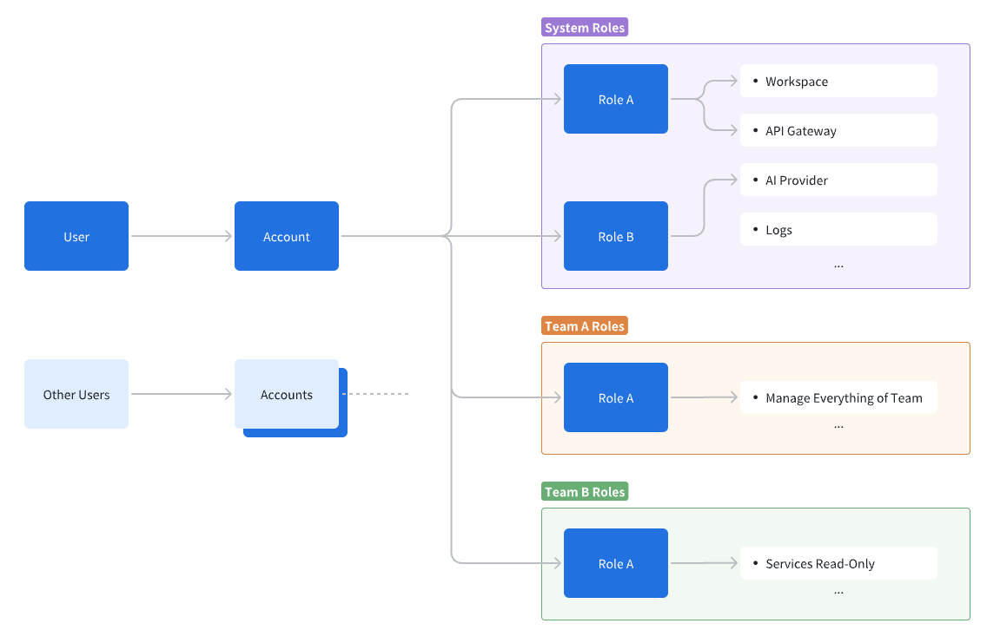
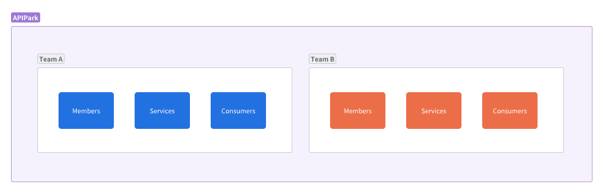

# Account and Roles

APIPark designs its user system based on the RBAC model, where the system administrator can create accounts for each member and assign roles to these accounts.

APIPark user roles are divided into **System-level Roles** and **Team-level Roles**:

- **System-level Roles**: These are user roles effective at the global level, controlling user permissions across the APIPark system, such as managing all members within APIPark, setting up API gateway clusters, and configuring global logs and data sources.
- **Team-level Roles**: These are user roles effective only within a team, controlling user permissions within the team, such as managing team members, and creating services and consumers within the team.

> 💡 The **Community Edition** comes with basic roles for users to easily assign roles and permissions. The **Business Edition** allows detailed permission setups for each role to meet complex enterprise security requirements. You can contact APIPark's sales team for more information.

## Creating an Account

Navigate to the **System Settings** module, select **Accounts** on the sidebar, click **Create Account**, and enter the following in the popup:

- **Username**: Used for logging into APIPark.
- **Email**: Used by the user to receive system notification messages from APIPark.
- **Department**: If no department is selected, it will automatically be set to **Unassigned**.

> 💡 The initial password for a new account is **12345678**. To avoid data leaks, please change the account password promptly.

## Setting System-level Roles for an Account

Navigate to the **System Settings** module, select **Accounts** on the sidebar, where you can assign multiple system-level roles to a user in the account list.

## Setting Team-level Roles for an Account

You can create multiple teams within APIPark, where a team functions similar to a tenant concept, with each team having its own members, services, and consumers. You can use the team feature to manage complex organizational structures.

You need to first create a team and then add members to it before setting roles for those members within that team.

For creating a team, refer to: [🔗 Create a Team](../teams.md)