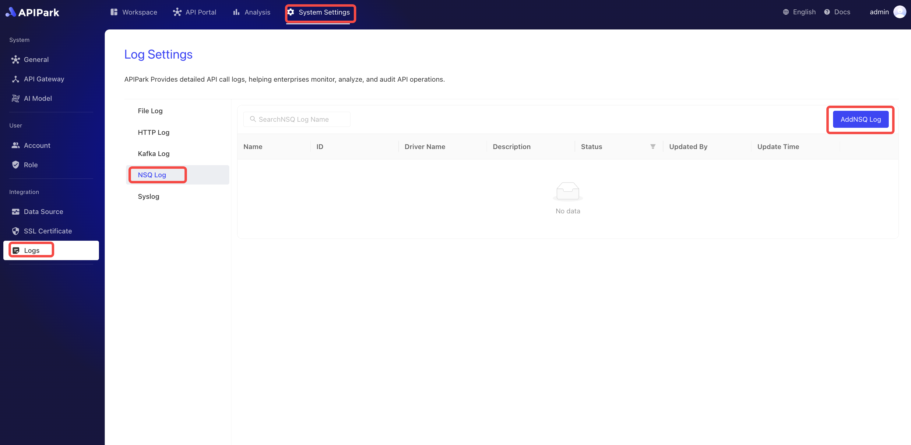

# NSQ Logs

## Introduction

Collect log information from the request gateway and output it to `NSQ`, making it convenient for users to perform secondary operations, such as log analysis.

## Features

Capable of outputting log content generated during program operation to a designated Topic in `NSQ`.

* Supports multiple `NSQD` request addresses
* Supports different log output formats
* Allows custom log formatting configuration

## Operational Demonstration

### Create NSQ Log Configuration

1. Click `Operations and Integration` -> `NSQ Logs`, then click `Add NSQ Logs`.



2. Fill in the NSQ log configuration, then click `Confirm`.


**Configuration Explanation**:

| Field Name     | Description                                                   |
| -------------- | ------------------------------------------------------------- |
| NSQD Address List | Address list for NSQD TCP service, supports multiple addresses |
| Topic            | Topic information for NSQD                                    |
| Auth Secret     | Authentication key for accessing NSQD                        |
| Output Format   | Log content output format, supports single-line or JSON format |
| Formatting Configuration   | Output format template, [Click Here](https://help.apinto.com/docs/formatter) for the tutorial |

**Example Formatting Configuration**

```json
{
   "fields": [
      "$time_iso8601",
      "$request_id",
      "@request",
      "@proxy",
      "@response",
      "@status_code",
      "@time"
   ],
   "request": [
      "$request_method",
      "$scheme",
      "$request_uri",
      "$host",
      "$header",
      "$remote_addr"
   ],
   "proxy": [
      "$proxy_method",
      "$proxy_scheme",
      "$proxy_uri",
      "$proxy_host",
      "$proxy_header",
      "$proxy_addr"
   ],
   "response": [
      "$response_headers"
   ],
   "status_code": [
      "$status",
      "$proxy_status"
   ],
   "time": [
      "$request_time",
      "$response_time"
   ]
}
```

### Deploy
1. Click the `Deploy` button next to the configuration you want to deploy.

