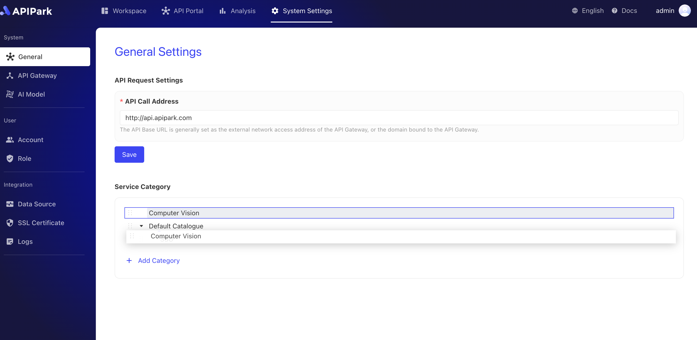

# General Settings

This module allows for the configuration of general settings in APIPark, including the display of API call addresses on the API portal, the service classification information to which services are bound, and more.

## Configure API Request Address

On the API Park platform, the **API Request Address** setting is used to specify the base URL (Base URL) for interface calls, providing a prefix for the complete path of API requests. Once configured in the system settings, the API request address is automatically used as a prefix for displaying API documentation and the actual request path, ensuring a uniform address format and enhancing management and call convenience.

### Main Function Logic

1. **Set Base URL**: Administrators can configure the `API Request Address` in the "General Settings" of the system settings, such as `http://api.apipark.com`. This is the base path of the platform's API, serving as the prefix address for all API calls.
2. **Document Display**: When users view API documentation in the API portal, the configured base URL will automatically show in front of the API address. For example, a translation API path `/demo_translation_api` will display as `http://api.apipark.com/demo_translation_api`.
3. **Unified Call Path**: By setting a uniform `API Request Address` in the system, users do not need to manually concatenate the base path when calling the API, focusing only on the specific API resource path, which reduces errors and configuration complexity.
4. **Dynamic Updates**: If the `API Request Address` changes, all API paths displayed in the documentation will automatically update, maintaining consistency between documentation and actual call addresses, ensuring system flexibility and ease of maintenance.

### Application Scenarios

- **Unified Management**: Suitable for scenarios requiring unified management of API request addresses, ensuring that all API services are published under the same domain or base path for ease of maintenance and security control.
- **Multi-Environment Support**: In different environments (such as development, testing, production), different `API Request Addresses` can be used without modifying the path configuration of each API.

### Operation Steps

1. Click `System Settings` -> `General` to enter the general settings page.

2. Enter the API call address, formatted as `http/https`+`://` + `{ip}`/`domain` + `port number`, and click `Save` after completion.

After configuration, the API call address will automatically populate in the documentation, as shown below:

## Service Classification

In the API Park platform, the **Service Classification Module** is used to classify and manage different types of services. When creating services (including REST services and AI services), the system mandates binding a service classification to facilitate filtering and browsing services by category in the API portal. This module not only enhances the organizational aspect of service management but also helps users quickly find the services they need in the API portal.

### Main Features

1. **Classification Binding**: Every newly created service must be bound to a service classification. Thus, whether it's a REST service or an AI service, it can be organized by its function or application scenario, facilitating management and usage.
2. **Service Filtering**: In the API portal, users can filter the service list based on service classification, allowing them to quickly locate services and improving search efficiency, particularly when many services are available.
3. **Subcategory Support**: The service classification module supports creating subcategories for more detailed classification management. For example, different domain subcategories (such as natural language processing, computer vision) can be established under the "AI Service" category to help users locate specific services more accurately.
4. **Sorting Function**: Classification and subcategories support sorting, allowing administrators to adjust the display order of categories based on priority or frequency of use, making important or commonly used categories more prominent.

### Application Scenarios

- **Clear Classification Management**: Through layered management and display of services, developers, testers, and business personnel can quickly find the services they need.
- **Enhancing User Experience**: In the API portal, service classification helps users filter and locate necessary services on demand, especially effective in scenarios with a large number of services and diverse applications.

The service classification module plays an important organizational and navigational role on the API Park platform. With features like classification binding, filtering, subcategories, and sorting, it provides efficient solutions for service management, usage, and search, significantly improving user experience and system maintainability.

### Operation Steps

#### Create a New Category
1. Click `System Settings` -> `General` to enter the general settings page, then click `New Category`.

2. Fill in the category name in the pop-up box and click `Confirm`.

#### Create a Subcategory
1. Click the menu button behind the category, then select `New Subcategory` in the pop-up box.

2. Fill in the subcategory name in the pop-up box and click `Confirm`.

#### Category Sorting
1. Click the sorting button in front of the category, as shown below.

2. Drag the category until the sorting is correct, as shown below.

