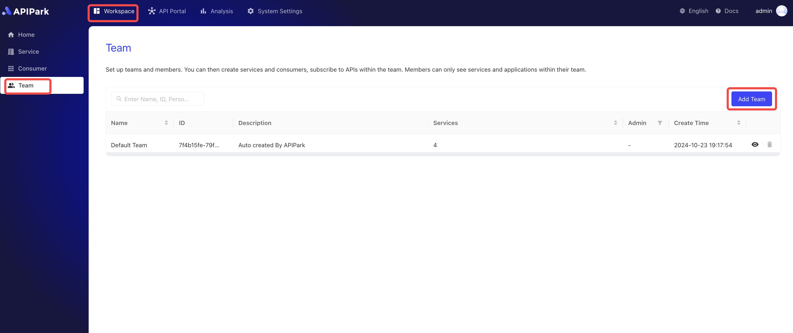

# Team

You can create multiple teams in APIPark. A team is similar to the concept of a tenant, where each team has its own members, services, and consumers. You can use the team feature to manage complex organizational structures.

## Team Management

### Create a New Team

1. Click `Workspace` -> `Team` -> `Create New Team`.

  

2. Enter the team information in the pop-up box, and click `Confirm` once completed.

  

**Field Descriptions**

<table><thead><tr><th width="203">Field Name</th><th>Description</th></tr></thead><tbody><tr><td>Team Name</td><td>Used to identify and distinguish different teams. The team name should be clear and precise, accurately reflecting the team's responsibilities and tasks.</td></tr><tr><td>Team ID</td><td>A unique identifier for the team, customizable.</td></tr><tr><td>Team Leader</td><td>Designate a team leader. Once the team is created, this person will be given the team administrator role.</td></tr><tr><td>Description</td><td>Record and display detailed information and notes related to a specific team.</td></tr></tbody></table>

## Team Members

In the member module, administrators can easily add or remove team members and assign appropriate permissions to each member, ensuring that they can only access and operate on the parts they are authorized to.

The permission setting feature makes team management more flexible and secure. Different roles can be assigned different access levels, such as administrator, developer, viewer, etc. This not only enhances work transparency and efficiency but also ensures the secure management of sensitive information.

:::tip
Members added to the team by default receive the `Application Developer` team role.
:::

1. Click on the team where you want to add members to enter the team page.

  

2. Click the `Account` navigation bar, then click the `Add Member` button.

  

3. In the pop-up box, select the members you want to add to the team and move them to the right.

Once the operation is completed, click Confirm.