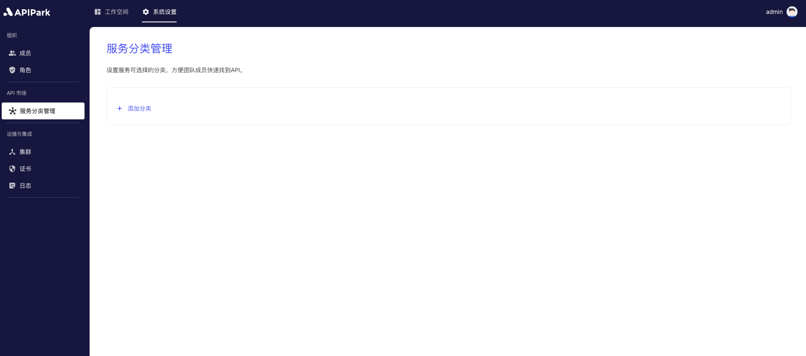
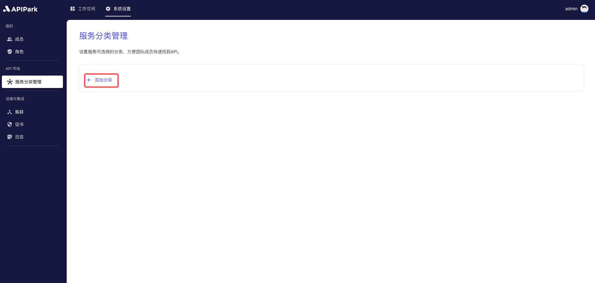

# 添加服务分类

为API设置可选择的分类标签，便于团队成员在API市场中快速查找和使用所需的API。

通过明确的多层级分类结构，提高了API的可发现性和组织性，帮助团队更高效地进行开发和运维工作，提升整体工作效率和协作水平。

## 操作演示

1. 点击`系统设置` -> `API市场` -> `服务分类管理`，进入服务分类列表页面。

  

2. 点击`添加分类`。

  

3. 在弹出框中输入分类名称后，点击`确认`。

  

### 
