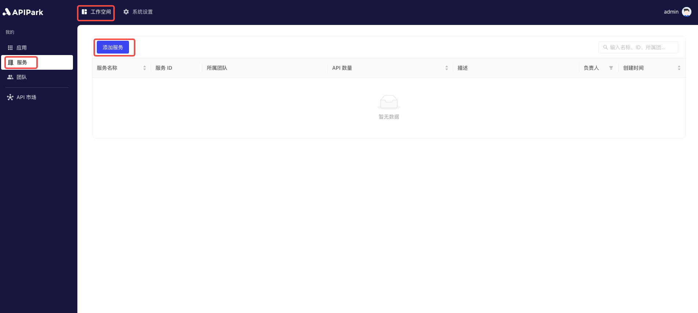

# 添加服务

作为服务提供方，首先需要在平台上添加新的服务。在添加服务时，填写服务名称、描述等必要信息。服务名称应该简洁明了，描述应包含服务的主要功能和用途。

## 操作演示

1. 点击`工作空间` -> `我的` -> `服务`，进入服务列表页面，点击`添加服务`。

  

2. 在弹出框中填写服务信息。

  

  

**字段说明**

<table><thead><tr><th width="169">字段名</th><th>说明</th></tr></thead><tbody><tr><td>服务名称</td><td>用来标识和描述该服务的名称。</td></tr><tr><td>服务ID</td><td>服务ID用于唯一标识服务，确保在管理和操作时可以准确区分不同的服务。服务ID在内部系统和调用过程中使用，不易更改。</td></tr><tr><td>API调用前缀</td><td>指调用该服务的API时使用的URL前缀。用于统一管理和路由API请求，确保请求能够正确定位到目标服务。前缀应与服务名称相关联，并易于记忆和使用。</td></tr><tr><td>描述</td><td>记录和展示服务的详细信息和功能说明。</td></tr><tr><td>所属团队</td><td>负责管理和维护该服务的团队。</td></tr><tr><td>图标</td><td>该图标将展示在服务广场中。</td></tr><tr><td>标签</td><td>服务自定义标签，方便订阅方快速查找。</td></tr><tr><td>服务类型</td><td>若为<b>外部服务</b>，订阅方可在服务广场中获取并申请订阅，提供方审批通过后，即可发起调用。 若为<b>内部服务</b>，仅能通过提供方分配订阅方的方式分配调用权限。</td></tr><tr><td>所属服务分类</td><td>选择展示在服务广场中的服务分类</td></tr></tbody></table>

在此处，我们的服务类型选择`外部服务`，并选择`所属服务分类`，填写完成后，点击`提交`即可。

若无服务分类，请参考教程[添加服务分类](./catalogue.md#操作演示)
