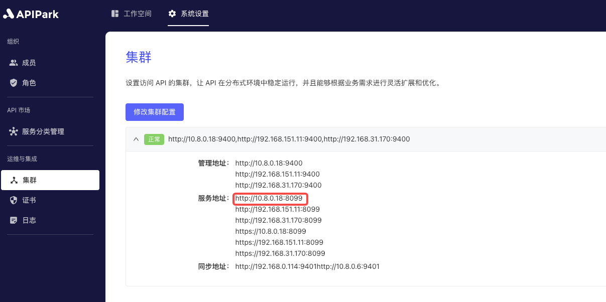

# 调用API

在审批通过后，订阅方可以使用已经通过审批的应用信息来调用所订阅服务的API，并获取实际的调用结果。这意味着一旦订阅申请被批准，用户就能够通过应用的访问授权安全地访问和使用服务，执行相关操作，并得到相应的数据或反馈。

## 操作演示

:::tip

在调用前，需要满足以下条件

1. 应用配置了访问授权，若无，请参考教程 [配置访问授权](./authorization.md)。
2. 应用提交了该API所属的服务的订阅申请，若无，请参考教程 [申请订阅](./subscribe.md)。
3. 订阅审批通过，若无，请联系服务提供方对申请进行审批，请参考教程 [审批订阅](../provider/approve.md)。

:::

假设在 [配置访问授权](./authorization.md)操作中，配置的鉴权信息如下：

  

集群的服务地址为`http://10.8.0.18:8099`，如下图：

  

API的调用信息如下：

  

您可以使用以下任意一种方式进行调用服务API。

<details>
<summary>CURL</summary>

选择一台可访问分区网关节点的`服务器/虚拟机/PC`，执行下述命令：

```sh
curl -X POST -H "Authorization: 59eb96b4-cfaf-4d8b-8f12-2d383c04264e" \
-H "Content-Type: application/json" -d "{\"username\":\"admin\",\"password\":\"$pbkdf2-sha512$i=1000,l=32$CzQQIAgUJxBR3WxhuZjU2w$3scp3ONqDeC8Sg80ESdTzhW3SL5vPfj/HmU8If6YYdc\"}" \
http://10.8.0.18:8099/sso/user/login
```

调用结果如图所示
  

</details>

