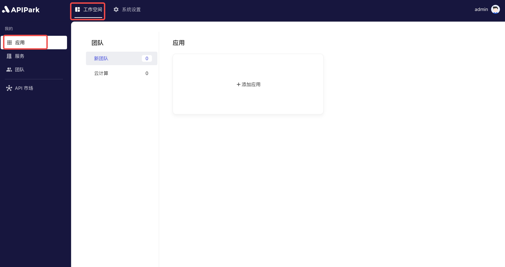

# 应用管理

在 `APIPark`中，**应用** 是服务订阅方用来管理和组织 API 订阅的单位。每个订阅方可以创建和管理多个应用，并且在订阅 API 服务时以应用为单位进行操作。通过这种方式，可以灵活地管理不同项目或业务线的 API 订阅和调用。

## 操作演示
### 添加应用
1. 点击`工作空间` -> `我的` -> `应用`，进入应用列表。

  

2. 选中需要添加应用的团队，点击`添加应用`。

  

3. 在弹出框中输入应用信息，填写完成后，点击`确认`。

  

### 编辑应用信息
1. 选择需要编辑的应用，点击后进入应用内页。

  

2. 点击`应用管理`，编辑应用信息，编辑完后点击保存。

  

### 删除应用

1. 在`应用管理`页面，点击下方的`删除应用`。

  
