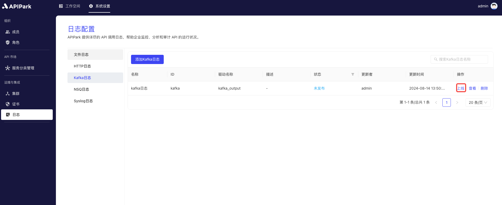

# Kafka日志

收集请求网关的日志信息，并将其输出到`Kafka`中，方便使用者进行二次操作，如日志分析等。

## 特性

能够将程序运行中产生的日志内容输出到指定Kafka集群队列中。

## 操作演示

### 新建Kafka日志配置

1. 点击左侧导航栏`运维与集成` -> `日志配置` -> `Kafka日志`，点击`添加Kafka日志`。

  

2. 填写Kafka日志配置。

  


**配置说明**：

<table><thead><tr><th width="208">字段名称</th><th>说明</th></tr></thead><tbody><tr><td>版本</td><td>Kafka版本</td></tr><tr><td>服务器地址</td><td>Kafka服务地址，多个地址用英文逗号分隔</td></tr><tr><td>Topic</td><td>Kafka服务Topic信息</td></tr><tr><td>Partition Type</td><td>partition的选择方式，默认采用hash，选择hash时，若partition_key为空，则采用随机选择random</td></tr><tr><td>Partition</td><td>Partition Type为manual时，该项指定分区号</td></tr><tr><td>Partition Key</td><td>Partition Type为hash时，该项指定hash值</td></tr><tr><td>请求超时时间</td><td>超时时间，单位为second</td></tr><tr><td>输出格式</td><td>输出日志内容格式，支持单行、Json格式输出</td></tr><tr><td>格式化配置</td><td>输出格式模版，配置教程<a href="https://help.apinto.com/docs/formatter">点此</a>进行跳转</td></tr></tbody></table>

**示例格式化配置**

```json
{
   "fields": [
      "$time_iso8601",
      "$request_id",
      "@request",
      "@proxy",
      "@response",
      "@status_code",
      "@time"
   ],
   "request": [
      "$request_method",
      "$scheme",
      "$request_uri",
      "$host",
      "$header",
      "$remote_addr"
   ],
   "proxy": [
      "$proxy_method",
      "$proxy_scheme",
      "$proxy_uri",
      "$proxy_host",
      "$proxy_header",
      "$proxy_addr"
   ],
   "response": [
      "$response_header"
   ],
   "status_code": [
      "$status",
      "$proxy_status"
   ],
   "time": [
      "$request_time",
      "$response_time"
   ]
}
```

3、点击`提交`后，Kafka日志配置添加完成

  


### 上线

1. 点击待上线配置后方的`上线`按钮。

  
