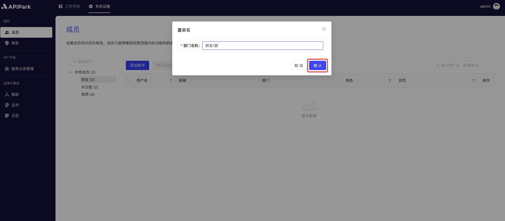
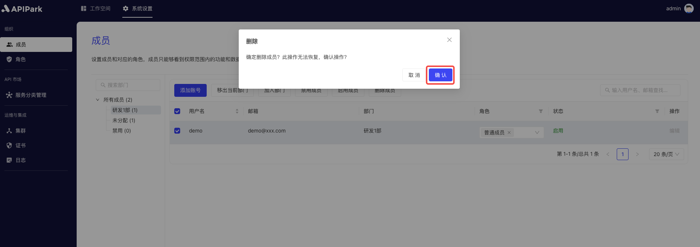

# 成员
## 简介
成员管理模块是API开放平台系统中的关键组件，专门用于管理用户账号和组织架构。该模块提供了一系列功能，确保系统内的成员管理高效且有序。

## 功能描述：

1. **新建账号**：
   - 支持管理员创建新的用户账号。
   - 新建账号时，可以设置基本信息如用户名、邮箱、部门等。
2. **启用/停用成员**：
   - 管理员可以启用或停用成员账号。
   - 启用功能确保成员能够正常访问系统资源。
   - 停用功能则在成员离职或不再需要访问权限时，迅速限制其访问，以保证系统安全。
3. **组织架构管理**：
   - 支持查看和编辑公司的组织架构。
   - 管理员可以创建、修改和删除部门，确保组织结构的准确性和及时更新。
4. **成员分配**：
   - 可以将成员分配到不同的部门，反映他们的实际工作位置和职责。
   - 支持批量操作，方便管理员一次性调整多个成员的部门归属。
   - 提供搜索和筛选功能，快速定位并分配成员。
   - 分配用户角色，确保每个成员只能访问和操作其权限范围内的资源。
## 操作演示
### 添加部门/子部门

1. 点击`系统设置` -> `组织` -> `成员`，进入成员列表页面。

  

2. 点击部门列表后方的菜单按钮，点击`添加子部门`。

  

3. 在弹出框中输入部门名称，填写完成后点击`确认`。

  

### 重命名部门名称

1. 点击`系统设置` -> `组织` -> `成员`，进入成员列表页面。

  

2. 点击部门列表后方的菜单按钮，点击`重命名`。

  

3. 在弹出框中输入部门的名称，点击`确定`。

  

### 删除部门

1. 点击`系统设置` -> `组织` -> `成员`，进入成员列表页面。

  

2. 点击部门列表后方的菜单按钮，点击`删除`。

  

3. 在弹出框中点击`确认`。

  

### 添加账号
1. 点击`系统设置` -> `组织` -> `成员`，进入成员列表页面。

  

2. 点击`添加账号`按钮。

  

3. 在弹出框中填写`用户名`、`邮箱`、`部门`信息，填写完后点击确定。

  

账号添加后，会自动分配`普通成员`的系统角色

### 加入部门

1. 点击`系统设置` -> `组织` -> `成员`，进入成员列表页面。

 

2. 选中成员，点击`加入部门`。

  

### 移出当前部门

1. 点击`系统设置` -> `组织` -> `成员`，进入成员列表页面。

 

2. 选中需要移出部门的成员，点击`移出当前部门`。

  

3. 在弹出框中点击`确认`。

  

### 启用成员

1. 点击`系统设置` -> `组织` -> `成员`，进入成员列表页面。

  

2. 选中需要启用的成员，点击`启用成员`。

  

### 禁用成员

1. 点击`系统设置` -> `组织` -> `成员`，进入成员列表页面。

  

2. 选中需要禁用的成员，点击`禁用成员`。

  

### 删除成员

1. 点击`系统设置` -> `组织` -> `成员`，进入成员列表页面。

  

2. 选中需要删除的成员，点击`删除成员`。

  

3. 在弹出框中点击`确认`。

  
