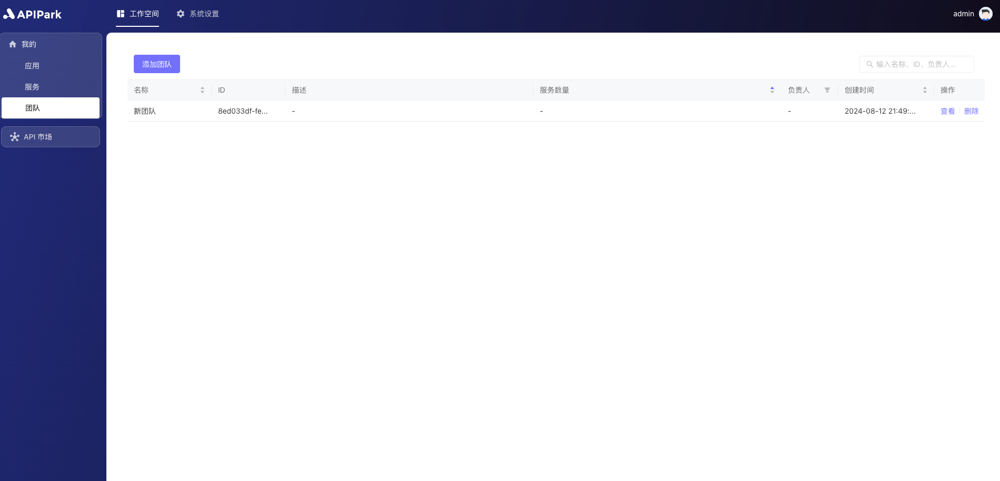

# 角色

角色模块用于定义和管理系统级别和团队级别的角色及其对应的权限。通过角色模块，管理员可以灵活地控制用户对系统和团队资源的访问权限，确保安全性和管理的高效性。

## 功能描述：

1. **系统级别角色管理**：
   - **创建和编辑角色**：管理员可以创建新的系统级别角色，或编辑现有角色。每个角色可以设置不同的权限，覆盖系统内的各种功能和资源。
   - **权限配置**：系统级别角色的权限配置灵活，支持精细化的权限分配，确保每个角色仅能访问其职责范围内的资源和功能。
2. **团队级别角色管理**：
   - **创建和编辑团队角色**：管理员可以根据团队的需求，创建和管理团队级别的角色。每个团队角色可以有不同的权限设置，以满足团队内部的管理需求。
   - **权限配置**：团队级别角色的权限配置，可以针对团队内的资源和功能进行细致的权限设置，确保团队成员能够高效协作。
3. **权限管理**：
   - **细粒度权限控制**：支持对系统功能和数据的细粒度权限控制，管理员可以根据实际需求，灵活调整每个角色的权限设置。
4. **角色与成员关联**：
   - **系统角色分配**：在成员管理模块中，管理员可以为成员设置系统级别角色，使其能够访问和操作系统级别的资源和功能。
   - **团队角色分配**：在团队模块的成员管理功能中，管理员可以为成员设置团队级别角色，使其在团队内拥有相应的权限，支持团队的高效运作。

## 角色权限一览
### 系统级别权限

<table>
  <tr>
    <th></th>
    <th></th>
    <th></th>
    <th>最高管理员（无法删改）</th>
    <th>团队管理员</th>
    <th>运维管理员</th>
    <th>[默认] 普通成员</th>
  </tr>
  <tr>
    <th rowspan="6">组织</th>
    <td rowspan="2">成员</td>
    <td>查看</td>
    <td>✔</td>
    <td></td>
    <td></td>
    <td></td>
  </tr>
  <tr>
    <td>管理</td>
    <td>✔</td>
    <td></td>
    <td></td>
    <td></td>
  </tr>
  <tr>
    <td rowspan="2">团队</td>
    <td>查看</td>
    <td>✔</td>
    <td>✔</td>
    <td></td>
    <td></td>
  </tr>
  <tr>
    <td>管理</td>
    <td>✔</td>
    <td>✔</td>
    <td></td>
    <td></td>
  </tr>
  <tr>
    <td rowspan="2">角色</td>
    <td>查看系统角色</td>
    <td>✔</td>
    <td></td>
    <td></td>
    <td></td>
  </tr>
  <tr>
    <td>查看团队角色</td>
    <td>✔</td>
    <td>✔</td>
    <td></td>
    <td></td>
  </tr>
  <tr>
    <th rowspan="2">API市场</th>
    <td rowspan="2">服务分类</td>
    <td>查看</td>
    <td>✔</td>
    <td></td>
    <td>✔</td>
    <td></td>
  </tr>
  <tr>
    <td>管理</td>
    <td>✔</td>
    <td>✔</td>
    <td></td>
    <td></td>
  </tr>
  <tr>
    <th rowspan="8">运维</th>
    <td rowspan="2">集群</td>
    <td>查看</td>
    <td>✔</td>
    <td></td>
    <td>✔</td>
    <td></td>
  </tr>
  <tr>
    <td>管理</td>
    <td>✔</td>
    <td></td>
    <td>✔</td>
    <td></td>
  </tr>
  <tr>
    <td rowspan="2">SSL证书</td>
    <td>查看</td>
    <td>✔</td>
    <td></td>
    <td>✔</td>
    <td></td>
  </tr>
  <tr>
    <td>管理</td>
    <td>✔</td>
    <td></td>
    <td>✔</td>
    <td></td>
  </tr>
  <tr>
    <td rowspan="2">日志</td>
    <td>查看</td>
    <td>✔</td>
    <td></td>
    <td>✔</td>
    <td></td>
  </tr>
  <tr>
    <td>管理</td>
    <td>✔</td>
    <td></td>
    <td>✔</td>
    <td></td>
  </tr>
  <tr>
    <td rowspan="2">OpenAPI</td>
    <td>查看</td>
    <td>✔</td>
    <td></td>
    <td>✔</td>
    <td></td>
  </tr>
  <tr>
    <td>管理</td>
    <td>✔</td>
    <td></td>
    <td>✔</td>
    <td></td>
  </tr>
  <tr>
    <td rowspan="2">仪表盘</td>
    <td>运行视图</td>
    <td>查看</td>
    <td>✔</td>
    <td></td>
    <td>✔</td>
    <td></td>
  </tr>
  <tr>
    <td>系统拓扑图</td>
    <td>查看</td>
    <td>✔</td>
    <td></td>
    <td>✔</td>
    <td></td>
  </tr>
  <tr>
    <th rowspan="4">工作空间</th>
    <td>应用</td>
    <td>查看所有应用（若不勾选，则只查看已加入的）</td>
    <td>✔</td>
    <td>✔</td>
    <td>✔</td>
    <td></td>
  </tr>
  <tr>
    <td>服务</td>
    <td>查看所有服务（若不勾选，则只查看已加入的）</td>
    <td>✔</td>
    <td>✔</td>
    <td>✔</td>
    <td></td>
  </tr>
  <tr>
    <td>团队</td>
    <td>查看所有团队（若不勾选，则只查看已加入的）</td>
    <td>✔</td>
    <td>✔</td>
    <td>✔</td>
    <td></td>
  </tr>
  <tr>
    <td>API市场</td>
    <td>查看</td>
    <td>✔</td>
    <td>✔</td>
    <td>✔</td>
    <td>✔</td>
  </tr>
</table>

### 团队级别权限

<table>
  <tr>
    <th></th>
    <th></th>
    <th></th>
    <th>团队管理员</th>
    <th>服务管理员</th>
    <th>服务开发者</th>
    <th>应用管理员</th>
    <th>[默认] 应用开发者</th>
  </tr>
  <tr>
    <th rowspan="10">服务</th>
    <td rowspan="2">API</td>
    <td>查看</td>
    <td>✔</td>
    <td>✔</td>
    <td>✔</td>
    <td></td>
    <td></td>
  </tr>
  <tr>
    <td>管理</td>
    <td>✔</td>
    <td>✔</td>
    <td>✔</td>
    <td></td>
    <td></td>
  </tr>
  <tr>
    <td rowspan="2">上游</td>
    <td>查看</td>
    <td>✔</td>
    <td>✔</td>
    <td>✔</td>
    <td></td>
    <td></td>
  </tr>
  <tr>
    <td>管理</td>
    <td>✔</td>
    <td>✔</td>
    <td>✔</td>
    <td></td>
    <td></td>
  </tr>
  <tr>
    <td rowspan="2">发布</td>
    <td>查看</td>
    <td>✔</td>
    <td>✔</td>
    <td>✔</td>
    <td></td>
    <td></td>
  </tr>
  <tr>
    <td>管理</td>
    <td>✔</td>
    <td>✔</td>
    <td>✔</td>
    <td></td>
    <td></td>
  </tr>
  <tr>
    <td rowspan="2">订阅方管理（包括订阅方审批和订阅方列表）</td>
    <td>查看</td>
    <td>✔</td>
    <td>✔</td>
    <td></td>
    <td></td>
    <td></td>
  </tr>
  <tr>
    <td>管理</td>
    <td>✔</td>
    <td>✔</td>
    <td></td>
    <td></td>
    <td></td>
  </tr>
  <tr>
    <td>服务管理</td>
    <td>管理（新增、修改、删除服务）</td>
    <td>✔</td>
    <td>✔</td>
    <td></td>
    <td></td>
    <td></td>
  </tr>
  <tr></tr>
  <tr>
    <th rowspan="6">应用</th>
    <td rowspan="2">订阅服务</td>
    <td>查看</td>
    <td>✔</td>
    <td></td>
    <td></td>
    <td>✔</td>
    <td>✔</td>
  </tr>
  <tr>
    <td>管理</td>
    <td>✔</td>
    <td></td>
    <td></td>
    <td>✔</td>
    <td>✔</td>
  </tr>
  <tr>
    <td rowspan="2">访问授权</td>
    <td>查看</td>
    <td>✔</td>
    <td></td>
    <td></td>
    <td>✔</td>
    <td>✔</td>
  </tr>
  <tr>
    <td>管理</td>
    <td>✔</td>
    <td></td>
    <td></td>
    <td>✔</td>
    <td></td>
  </tr>
  <tr>
    <td rowspan="2">应用管理</td>
    <td>管理（新增、修改、删除应用）</td>
    <td>✔</td>
    <td></td>
    <td></td>
    <td>✔</td>
    <td></td>
  </tr>
  <tr></tr>
  <tr>
    <th rowspan="4">团队</th>
    <td rowspan="2">成员</td>
    <td>查看</td>
    <td>✔</td>
    <td>✔</td>
    <td>✔</td>
    <td>✔</td>
    <td>✔</td>
  </tr>
  <tr>
    <td>管理</td>
    <td>✔</td>
    <td></td>
    <td></td>
    <td></td>
    <td></td>
    <td></td>
  </tr>
  <tr>
    <td rowspan="2">团队管理</td>
    <td>查看</td>
    <td>✔</td>
    <td></td>
    <td></td>
    <td></td>
    <td></td>
  </tr>
  <tr>
    <td>管理（修改、删除团队）</td>
    <td>✔</td>
    <td></td>
    <td></td>
    <td></td>
    <td></td>
    <td></td>
  </tr>
</table>

## 操作演示
### 查看角色权限
1. 点击`系统设置` -> `组织` -> `角色`，进入角色列表页面。

  

2. 点击角色后方的`查看`按钮，进入角色详情页面。

  

  

### 修改成员系统角色
:::tip
当前用户需要有系统级别权限：`组织` -> `成员` -> `管理`。
:::

1. 点击`系统设置` -> `组织` -> `成员`，进入成员列表页面。

  

2. 点击需要修改角色的成员，分配成员角色。

  

### 修改成员团队角色
:::tip

1. 当前用户已加入团队；

2. 当前用户在团队内需要有团队级别权限：`团队` -> `成员` -> `管理`

:::

1. 点击`工作空间` -> `我的` -> `团队` ，进入团队列表页面

  

2. 选中团队，进入团队内页。

  

3. 点击`成员`，进入成员列表

  

4. 点击需要修改角色的成员，分配成员角色。

  

