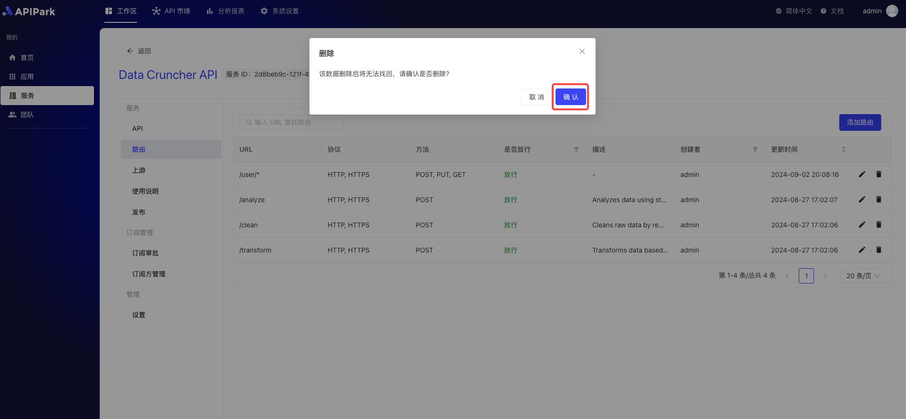

# 路由

路由是指API网关根据客户端请求的特定路径或条件，将请求转发到相应的后端服务的过程。API网关是一个位于客户端和服务器之间的中间层，用于管理、监控和路由客户端的API请求。它的路由功能是API网关的核心功能之一。

在API网关中，***\*路由\****通常是基于URL路径、HTTP方法（如GET、POST等）、请求头、查询参数等多种条件进行的。当API网关收到客户端的请求时，会根据预先配置的路由规则，决定将请求转发到哪个后端服务。

## 操作演示
### 添加路由

1. 选择需要配置的服务，进入服务内页。

  

2. 点击 "路由"

3. 点击 "添加路由"

4. 填写路由的基本信息

**字段描述**

| 字段名称         | 字段描述                                                     |
| :--------------- | :----------------------------------------------------------- |
| 拦截该接口的请求 | 是否拦截该接口的请求                                         |
| 请求方式         | 支持常见HTTP请求方式GET、POST、PUT、DELETE等，支持多选       |
| 请求路径         | API的URI，用于应用请求URL中的相对路径，支持Restful参数以及路径前缀匹配 |
| 高级匹配         | 支持通过请求头，请求参数、Cookie 进行路由匹配，可添加多条    |
| 转发上游路径     | 转发至上游的相对路径                                         |
| 请求超时时间     | 定义网关转发请求到上游至响应的超时时间                       |
| 重试次数         | 当转发请求到上游失败时，网关会自动触发重试转发请求，最大次数不超过重试次数 |
| 转发上游请求头   | 可对转发上游请求头进行新建、编辑以及删除参数，主要应用于网关与上游间鉴权 |

填写完后，点击 "提交" 按钮.

此指南涵盖了在应用程序中配置路由的所有步骤，包括选择路由选项，添加路由，选择请求方式，配置 API 基础信息，以及最终提交配置。

### 编辑路由

1. 点击待编辑路由后方的`编辑`按钮。

  

2. 填写路由信息。

  

填写完后点击提交即可。

### 删除路由
1. 点击待删除路由后方的`删除`按钮。

  

2. 在弹出框中点击确认。

  

### 删除路由
1. 点击待删除API后方的`删除`按钮。

  

2. 在弹出框中点击`确认`。

  
