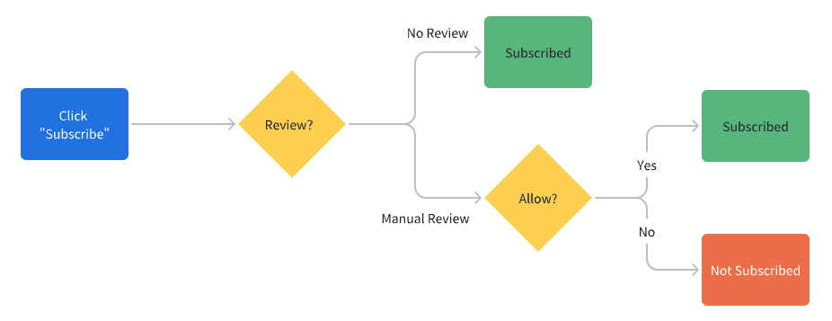
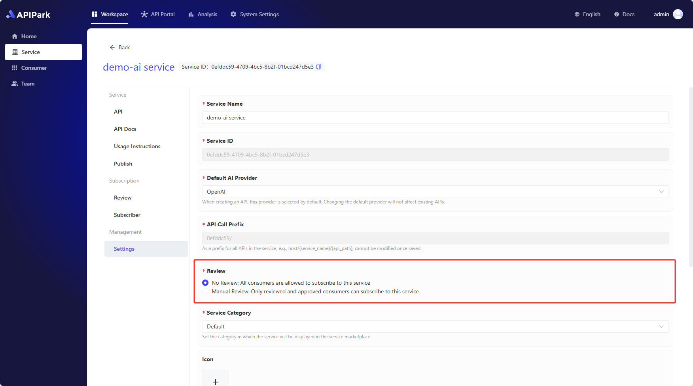

# 审核消费者

在 APIPark 中，**消费者（Consumer）** 是 **订阅服务** 和 **调用API** 的实体，消费者通过订阅服务来获得调用服务内API的权限，确保数据安全和访问权限合规。

为了保证安全、规范地使用 API，并且降低 API 的管理成本。用户需要先创建 **消费者**，并通过消费者订阅服务。

订阅了服务的 **消费者** 会出现在服务的 **审核** 列表中，审核分为两种方式：
- **无需审核**：APIPark 会自动通过消费者的订阅申请，消费者订阅服务之后即可调用该服务的 API。
- **人工审核**：消费者订阅服务之后，需要等待服务的管理员审核通过才能调用服务的 API，否则 APIPark 会拒绝 API 请求并提示缺少 API 的访问权限。

## 无需审核

如果服务设置为 **无需审核**，APIPark 会自动通过消费者的订阅申请，消费者在订阅服务之后即可调用该服务的 API。

你可以在服务的 **订阅者** 列表中看到所有订阅了该服务的 **消费者**。

## 人工审核

如果服务设置为 **人工审核**，消费者订阅服务之后，需要等待服务的管理员审核通过才能调用服务的 API，否则 APIPark 会拒绝 API 请求并提示缺少 API 的访问权限。

你可以在服务的 **审核** 列表中看到等待审核 **消费者**。

# 修改服务的审核方式

如果你希望修改服务的审核方式，进入服务管理界面，点击侧边栏的 **服务设置**，修改 **审核** 选项，然后点击保存即可。

