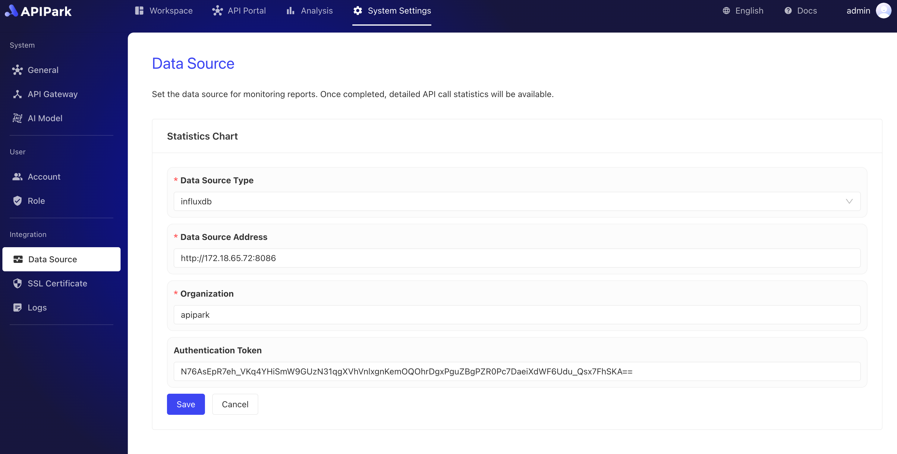

# 数据源

在**APIPark**中，数据源配置功能支持实时监控API流量与性能，以便服务提供方对API使用情况有深入了解。目前，平台支持**InfluxDB**作为数据源，通过灵活的数据采集和可视化展示，使API监控管理更加直观高效。

* **数据源配置与支持**：APIPark支持配置**InfluxDB**作为API监控的数据源，InfluxDB凭借其高效的时序数据处理能力，能够实时记录大量的API调用数据，适用于高频率的日志推送需求。未来，平台还将支持更多的数据源选项，以满足不同业务需求。

* **实时日志推送**：API网关节点将每次请求的日志推送到InfluxDB中，日志数据包括调用时间、响应状态、请求路径、消费者信息等关键信息，为后续分析和报告生成奠定数据基础。

* **自动化数据读取与处理**：APIPark从配置的InfluxDB数据源中自动读取监控数据，并对原始日志数据进行清洗、分类、统计和汇总，生成易于分析的指标，如API调用频率、响应时间分布、错误率等。

* **统计报表与可视化展示**：基于读取的数据，APIPark将生成多种统计报表，并以图表形式在平台内可视化展示。用户可以查看API调用趋势、性能指标、异常预警等关键监控数据，从而快速定位性能瓶颈或优化资源分配。

通过配置数据源，APIPark实现了API调用数据的全面监控和可视化管理，为服务提供方提供了数据驱动的洞察，帮助优化API性能、提升服务质量。

## 配置数据源

:::tip
在进行配置前，您需要配置安装并配置好InfluxDB数据库，若无，请参考教程[配置InfluxDB](../deploy.md#配置influxdb)
:::

1. 点击`系统设置` -> `数据源`，点击后方的`修改设置`。

  

2. 输入InfluxDB配置信息，填写完成后，点击`保存`。

  
