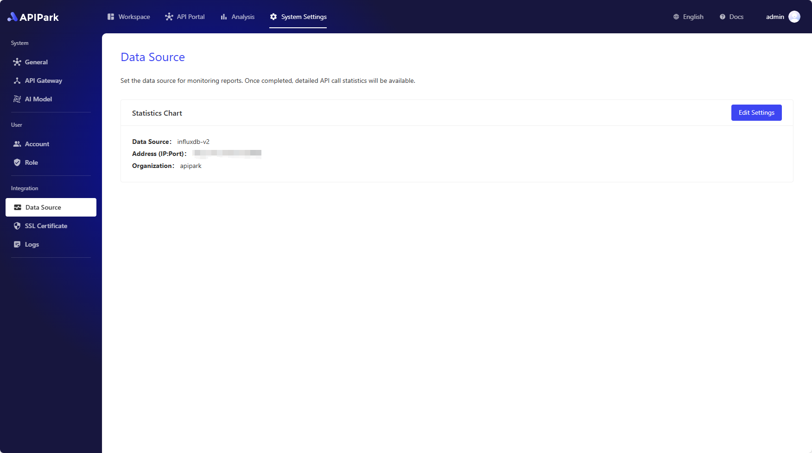

# 数据源

APIPark 会将 API 的调用统计数据存储在外部数据库中，便于生成各类分析报告。

## 设置分析图表的数据源

进入 **系统设置** 模块，在侧边栏点击 **数据源**，在数据源列表页面修改分析图表设置。

> 💡 APIPark 的 API 调用分析报告依赖于 InfluxDB 数据库。如果你使用 APIPark 官方提供的脚本部署，默认会安装 InfluxDB，了解更多：[🔗 部署 APIPark](deploy.md)。

🎉APIPark 还刚刚起步，我们期待与开源爱好者共同探索 AI+API 的无限可能。您的每个 Issue 对我们来说都至关重要。

🙏如果 APIPark 对您有所帮助，请在 GitHub 上为我们点亮星星，让更多人发现 APIPark。 [访问Github](https://github.com/APIParkLab/APIPark) 
